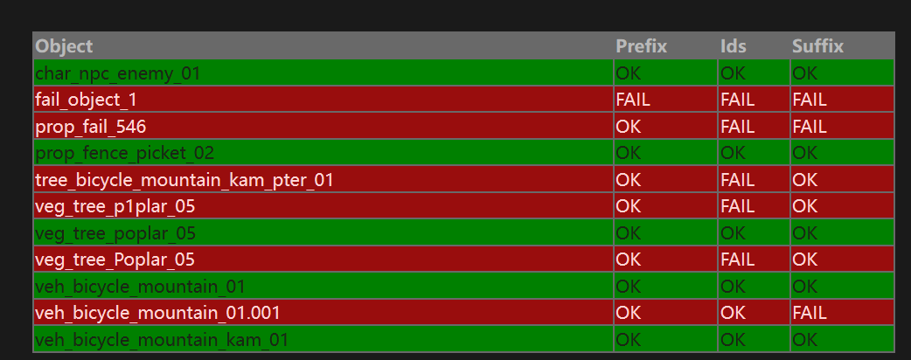
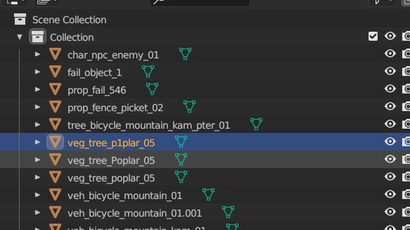
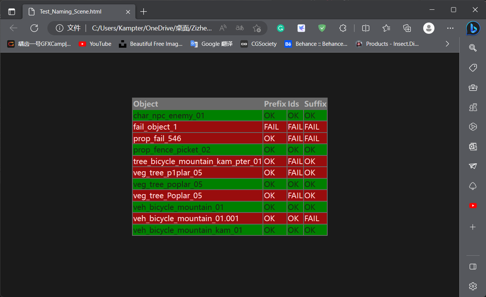
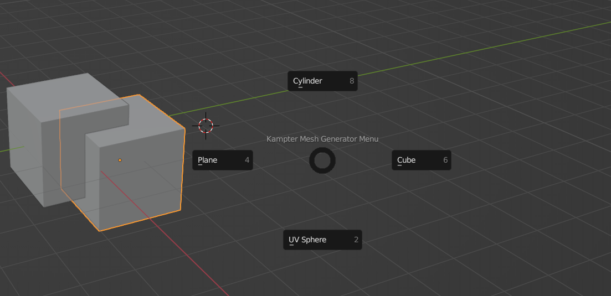

## 前言

一个偶然的机会接触到 Blender插件编写，一直以来我都是(曾经是) Maya以及Houdini软件的拥护者，但是Blender 的开源社区逐渐壮大也不能不引起重视，那么是时候了解一下Blender的相关内容。

Blender的交互层都是用Python来编写的，这就相当友好了。作为一个使用过python用来数据分析以及编写爬虫爬 *** 内容的人表示这很开心。

## 基础模板

```python
bl_info = {
    "name": "HelloAddon",
    "author": "作者",
    "version": (1, 0),
    "blender": (2, 79, 0),
    "location": "View3D > Tool Shelf >HelloAddon Panel",
    "description": "插件描述",
    "warning": "",
    "wiki_url": "",
    "category": "3D View",
}

import bpy
import logging
from . import model_data
from . import command_operators
from . import view_panels


def register():
    bpy.utils.register_module(__name__)
    command_operators.register()
    view_panels.register()


def unregister():
    bpy.utils.unregister_module(__name__)
    command_operators.unregister()
    view_panels.unregister()

if __name__ == "__main__":
    register()
```

整体思路还是比价简单的。以上代码就是套路，不需要理解，主体为bpy.utils.register_module(name)，作用是注册import进来的所有模块。至于*command_operators.register() 与 view_panels.register()则代表其他非模块相关的注册。这里的代码*以后要新建工程直接ctrl c即可。直接运行main函数，就可以注册插件。z注册插件后就可以编写自己的插件内容并且分别在 register() 和 unregister() 中调用。

## 编写一个 check object命名的功能吧

我希望我的这个插件可以实现的功能是遍历当前场景内全部的object，然后根据命名规则判断正确还是错误，命名规则如下。

>   ​	\<asset_type>_<descriptive_name>_<descriptive_name>_<##>

1.   其中<asset_type> 可以为 char, prop, veg,  veh, arch 和 tree
2.   中间的<descriptive_name>可以有2-3个不同的名字，并且全部为小写的英文字母
3.   最后的<##> 是数量，从01 最大可以到99

并且把最终的结果输出到一个html网页中并渲染出来。最终效果如下



先写基础模板把我的CheckNamesOperator 注册上去

```python
import bpy

def register():
    bpy.utils.register_class(CheckNamesOperator)


def unregister():
    bpy.utils.unregister_class(CheckNamesOperator)


if __name__ == "__main__":
    register()

    # test call
    bpy.ops.object.check_naming()

```

功能实现部分的思路如下。先遍历场景内的object， 然后读到这个object的当前命名内容，把他当作一串string。整体思路有点类似之前编程课写的string parser。这里把命名string用split("_")拆分为三部分并且放在一个tags list中

### Prefix

第一部分的asset_type 是prefix 用tags[0] 提取，判断第一部分的类型，可以预先用一个list把valid prefixes提前写好，判定提取的string是否在list中

```python
# Prefix
    if tags[0] in valid_prefixes:
        prefix_ok = True
```

### Suffix

第三部分的## 用tags[-1]提取, 最后一部分的内容是长度为2 的数字。数字的判定用python自带的ValueError来判定，如果不报错就是数字。

```python
# Suffix
nan = False
padding = len(tags[-1]) == suffix_padding

try:
    num = int(tags[-1])
except ValueError:
    nan = True
```

### Identifiers

中间的部分descriptive_name用tags[1:-1] 提取，先判断中间部分有几个descriptive_name, 规则只允许2-3个。其次要求descriptive_name全部为小写的英文字母

```Python
# Identifiers
errors = 0
if len(tags) - 2 not in num_indentifiers_required:
    errors += 1
for id in tags[1:-1]:
    if not id.isalpha():
        errors += 1
    if not id == id.lower():
        errors += 1
if errors == 0:
    ids_ok = True
```

这样最核心的判定就完全结束了。现在来编写输出的部分

class CheckNamesOperator(bpy.types.Operator):
    """Check Object Names"""
    bl_idname = "object.check_naming"
    bl_label = "Check Object Names"

```Python
@classmethod
def poll(cls, context):
    return context.active_object is not None

def execute(self, context):
    scene_objects = [[obj[0], obj[1]] for obj in bpy.data.objects.items()]

    results = []
    errors = 0

    for obj in scene_objects:
        v = validate_name(obj[0])
        if not all(v):
            errors += 1
        results.append({
            'object': obj[0],
            'prefix': 'OK' if v[0] else 'FAIL',
            'ids': 'OK' if v[1] else 'FAIL',
            'suffix': 'OK' if v[2] else 'FAIL',
            'pass': all(v)
        })

    if errors:
        self.message_errors(results)
    else:
        self.message_ok(message='No problems found!')

    return {'FINISHED'}

def message_ok(self, message="", title="OK!", icon='INFO'):
    def draw(self, context):
        self.layout.label(text=message)

    bpy.context.window_manager.popup_menu(draw, title=title, icon=icon)

def message_errors(self, results, title="Errors Found!", icon='ERROR'):
    scene_file = bpy.path.basename(bpy.data.filepath)
    scene_folder = path.dirname(bpy.data.filepath)

    base_file_name = '.'.join(scene_file.split('.')[0:-1]) + '.html'

    out_html_file = path.join(scene_folder, base_file_name)

    with open(out_html_file, 'w') as f:
        f.write('<html><head>')

        # Styles
        f.write("""
        <style type="text/css">
            table {
              margin: 0 auto;
              text-align: left;
            }
            tr.error{
              background-color: #990d0d;
              color: #ffd5d5;
            }
            tr.ok {
              background-color: green;
              color: #1a2615;
            }
            table {
              margin: 10% auto;
              width: 40%;
              background-color: dimgray;
            }
            th {
              color: #b9b9b9;
            }
            body {
              background-color: rgb(26, 26, 26);
            }
            </style></head><body><table>
        """)

        # Header
        f.write('<tr><th>Object</th><th>Prefix</th><th>Ids</th><th>Suffix</th></tr>')

        # Results
        for r in results:
            row_class = 'ok' if r['pass'] else 'error'
            f.write(
                f"<tr class=\"{row_class}\"><td>{r['object']}</td><td>{r['prefix']}</td><td>{r['ids']}</td><td>{r['suffix']}</td></tr>")

        f.write('</table></body></html>')

    # Open Generated html Results
    webbrowser.open(out_html_file)
```

这是一段我借鉴来的代码。主要涉及到几部分内容。

1.   这是一个class 的 CheckNamesOperator，也就是我们的检查器对象。
2.   其中最核心的部分在 exeute() 内，用以运行刚刚的检查逻辑函数，并且把结果保存在results[] 这个list中
3.   输出王爷的部分，其实这是一个调用IO的函数，主要是遍历刚刚我们保存下来的results 数组并且逐行按照我们的目标效果编译出来的，中间还涉及到html 和css代码（虽然挺丑的）。最终把Html保存在Blender相同的目录下面。

### 检查代码效果

创建几个object，并且根据我们的目标规则，更改命名。可以看到场景内对对错错的object有好几个，虽然我不是专业的测试，但是基础的边界测试还是要有的。



检查完自动弹出的检查结果窗口，很丑，但是可以提示我们哪里有错误，可以及时修改。



## 再写一个Pie Menu的Object生成菜单

### 插件的逻辑

1.    View3D_MT_PIE_template(menu) 用以继承官方的pie menu并且在下面添加我们自己的功能按钮，用pie.operator()
2.    View3D_OT_PIE_template_call(menu) 用以在场景内呼出这个菜单
3.   每一个功能按钮单独用一个class实现，bl_idname就是在pie.operator()中调用的id, 每一个功能按钮都有一个execute用以运行。其中的功能可以自行设计，我这里就调用比如生成plane, cube, sphere的代码
4.   额外编写一个add_hotkey()用以实现快捷键呼出菜单的功能，核心是这一段，用以调用场景内呼出菜单的效果。

```Python
km.keymap_items.new(
    VIEW3D_OT_PIE_template_call.bl_idname, 'D', 'PRESS', ctrl=True, shift=False)
```

5.   最后的最后，把全部实现的功能都注册在register()和unregister()中就可以了。

插件在Blender中效果实现如下



完整插件代码如下，可以直接复制并且安装在blender中，默认是shift + D呼出菜单。

```Python
import bpy
from bpy.types import Menu
''' 
Reference List 
1. https://www.youtube.com/watch?v=jfQTX293dw0
2. https://blender.stackexchange.com/questions/147894/is-there-a-way-to-add-a-custom-pie-menu-in-2-8
3. https://docs.blender.org/manual/en/latest/advanced/scripting/addon_tutorial.html
'''


bl_info = {
    "name": "Kampter Pie Menu",
    "author": "Kampter",
    "version": (0, 0, 0, 1),
    "description": "Pie Menus made by Kampter",
    "blender": (3, 40, 0),
    "category": "Mesh"
}

addon_keymaps = []


def add_hotkey():
    wm = bpy.context.window_manager
    kc = wm.keyconfigs.addon

    if not kc:
        print('Keymap Error')
        return
    # object Mode
    km = kc.keymaps.new(name='Object Mode', space_type='EMPTY')
    # here you can chose the keymapping.
    kmi = km.keymap_items.new(
        VIEW3D_OT_PIE_template_call.bl_idname, 'D', 'PRESS', ctrl=True, shift=False)
    addon_keymaps.append((km, kmi))


def remove_hotkey():
    for km, kmi in addon_keymaps:
        km.keymap_items.remove(kmi)

    addon_keymaps.clear()


class VIEW3D_MT_PIE_template(Menu):
    bl_label = 'Kampter Mesh Generator Menu'

    def draw(self, context):
        layout = self.layout
        prefs = context.preferences
        inputs = prefs.inputs

        pie = layout.menu_pie()
        pie.operator('kampter.plane')
        pie.operator('kampter.cube')
        pie.operator('kampter.sphere')
        pie.operator('kampter.cylinder')


class VIEW3D_OT_PIE_template_call(bpy.types.Operator):
    bl_idname = 'kampter.call'
    bl_label = 'Kampter Pie Menu'
    bl_description = 'Calls pie menu'
    bl_options = {'REGISTER', 'UNDO'}

    def execute(self, context):
        bpy.ops.wm.call_menu_pie(name="VIEW3D_MT_PIE_template")
        return {'FINISHED'}


class CREATE_PLANE(bpy.types.Operator):
    bl_idname = 'kampter.plane'
    bl_label = 'Plane'

    def execute(self, context):
        bpy.ops.mesh.primitive_plane_add(enter_editmode=False, align='WORLD', location=(-2.25724, -2.46012, 2.15026),
                                         scale=(1, 1, 1))
        return {'FINISHED'}


class CREATE_CUBE(bpy.types.Operator):
    bl_idname = 'kampter.cube'
    bl_label = 'Cube'

    def execute(self, context):
        bpy.ops.mesh.primitive_cube_add(enter_editmode=False, align='WORLD', location=(0, 0, 0), scale=(1, 1, 1))
        return {'FINISHED'}


class CREATE_UV_SPHERE(bpy.types.Operator):
    bl_idname = 'kampter.sphere'
    bl_label = 'UV Sphere'

    def execute(self, context):
        bpy.ops.mesh.primitive_uv_sphere_add(radius=1, enter_editmode=False, align='WORLD', location=(0, 0, 0),
                                             scale=(1, 1, 1))
        return {'FINISHED'}


class CREATE_CYLINDER(bpy.types.Operator):
    bl_idname = 'kampter.cylinder'
    bl_label = 'Cylinder'

    def execute(self, context):
        bpy.ops.mesh.primitive_cylinder_add(enter_editmode=False, align='WORLD',
                                            location=(-0.492159, -3.12005, -1.62732), scale=(1, 1, 1))
        return {'FINISHED'}


def register():
    bpy.utils.register_class(VIEW3D_MT_PIE_template)
    bpy.utils.register_class(VIEW3D_OT_PIE_template_call)
    bpy.utils.register_class(CREATE_PLANE)
    bpy.utils.register_class(CREATE_CUBE)
    bpy.utils.register_class(CREATE_UV_SPHERE)
    bpy.utils.register_class(CREATE_CYLINDER)
    add_hotkey()


def unregister():
    bpy.utils.unregister_class(VIEW3D_MT_PIE_template)
    bpy.utils.unregister_class(VIEW3D_OT_PIE_template_call)
    bpy.utils.unregister_class(CREATE_PLANE)
    bpy.utils.unregister_class(CREATE_CUBE)
    bpy.utils.unregister_class(CREATE_UV_SPHERE)
    bpy.utils.unregister_class(CREATE_CYLINDER)
    remove_hotkey()


if __name__ == "__main__":
    register()
```

Reference

1.   [blender插件开发入门 - 知乎 (zhihu.com)](https://zhuanlan.zhihu.com/p/63095684)
2.   https://www.youtube.com/watch?v=jfQTX293dw0
3.    https://blender.stackexchange.com/questions/147894/is-there-a-way-to-add-a-custom-pie-menu-in-2-8
4.   https://docs.blender.org/manual/en/latest/advanced/scripting/addon_tutorial.html
