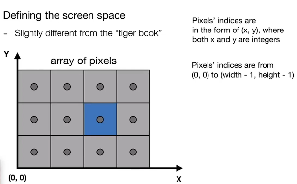
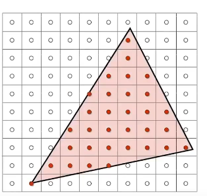
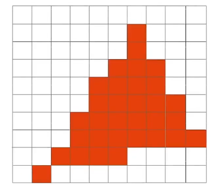

前言：只记录自己需要的内容

---

## 光栅化

屏幕空间 从（0，0）到（width, height）

光栅化的过程即采样过程，来判断屏幕上的像素点是否在三角形里面

采样的缺点：以点代面，有失偏颇 → Aliasing 走样，表现为锯齿

引入傅里叶变换，采样信息可以分解成函数表达



高频信息：简单来说就是outline边界，边界变化带来巨大的图像效果变化



只保留高频信息：表现为边缘部分



只保留低频信息：表现为画面主体



## 走样

走样就是采样的中出现重复或者没有采集到关键信息 （图中蓝色和黑色采样点相同，但是实际差距明显）



减少Aliasing Error 的方法

1.   增加采样率
2.   Antialiasing 先模糊（砍掉高频信号也就是画面边缘容易走样的位置）再采样
3.   MSAA 超采样 （增加单像素点内的采样点）
4.   FXAA 图像后期处理找到边界部分（走样的部分）替换成不走样的图像
5.   TAA 更立体的在相邻帧采样同一像素的不同位置
