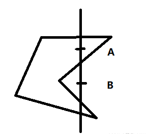
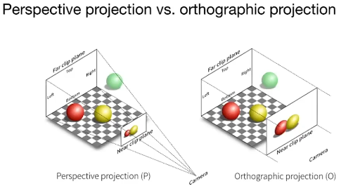
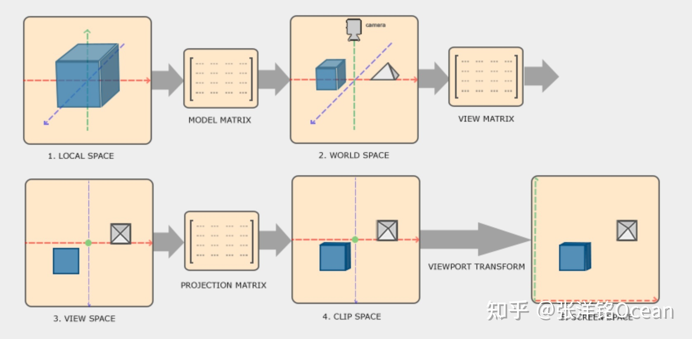

前言：只记录自己需要的内容

---

## 线代

### 判断点是否在三角形内的方法1



按照逆时针找到ab，bc，ca向量，当同时满足cross(ab * ap) > 0 && cross(bc * bp) > 0 && cross (ca * cp) > 0 时点在三角形内，如果有一个结果为0 点在这条边上，有一个小于0在三角形外。换种思路就是如果点在三角形内测，三次判断点都在封闭线段的左侧，即点在图形内。

### 判断点是否在三角形内的方法2

从远处发射一条光线，到无限远，如果与多边形交点为偶数，在图形外，否则在图形内。遍历多边形每一条边与光线相交，如果交点在这条边上，交点数 +1。

## 变换

### 齐次空间:  空间变化增加一个维度实现Transformation （图例为二维变换，三位变化同理增加一个维度到四维）



这样带来的好处是在一个矩阵就能完成Transformation操作 （Affine map是原本Transformation 需要两个矩阵操作）



### 模型空间：以模型为世界原点的坐标系（Local）

Model transformation 

### 世界空间：以世界坐标系（0，0，0）为原点，将模型摆放在世界Global坐标系中

View transformation

### 相机/观察空间：我们看到的画面由摄像机捕捉，摄像机参数决定了我们在屏幕上看到的东西，这一步可以将世界坐标系转换到摄像机坐标系。

Projection transformation

正交投影和透视投影：这也是Zbuffer储存深度信息的由来。投影变化包括从view变化到正交投影再变化到透视投影才输出至viewport视口显示再屏幕上。

投影的取值范围为[-1,  1]

--- 2023.02.04 更新 --- 

额外帮助理解的图片：空间变化的过程

以及在unity中实现空间变换部分的代码及说明

HCS齐次裁剪空间的xy坐标范围在[-w, w]之间

而NDC空间，是把视锥放映射到 -1 到 1的正方体中，也就是把HCS空间投影到[-1, 1]的范围内

## 参考

1.   [【04】Unity URP 卡通渲染 原神角色渲染记录-Depth-Based Effect: 7Spaces + 屏幕空间等距深度边缘光Rim Light - 知乎 (zhihu.com)](https://zhuanlan.zhihu.com/p/552098339)
