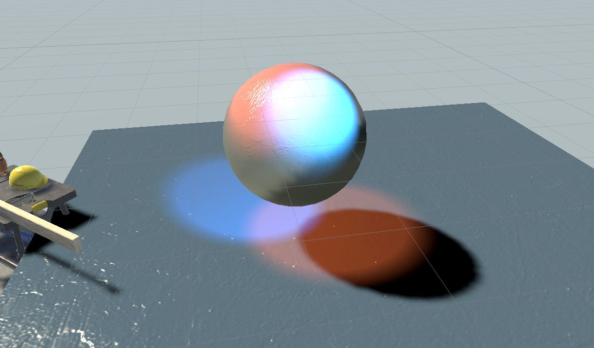

## ShadowMapping

### 原理



1. 先渲染一个从光源到物体的pass 获得深度图
2. 再渲染一个从相机位置到物体的pass获得深度图，并且把这个深度投影到光源位置 （图中橙色点为无阴影）



3. 比较第一次与第二次投影到光源的深度，如果相同即没有阴影；如果比原深度远，即在阴影中(图中红色点为在阴影中)

### 缺陷

- 走样、分辨率。数值精度问题
- 只能点光源、硬阴影
- 会产生自遮挡如果light 方向与物体平面接近平行



- 改善方式具体方式就是当一个点深度大于记录深度的值超过一个阈值bias时，我们才认为这个点在阴影内。

#### 解决方案

- 增加一个 bias
- 中间的黄色那段我们不算
  - 也就是说我们对计算得到的深度减去一个 bias
  
  

- 一些技巧：动态的 bias
  - 当光线和物体表面法线夹角比较大时，bias 也需要比较大
  - 当光线和物体表面法线夹角比较小时，bias 比较小即可
- 不合适的bias会出现阴影与物体中间出现间隔

--- 2022.12.15 更新 ---

Shadow map已经又引擎自动计算好不需要手动实现。

URP中对shadow map 采样。

其中开启阴影投射和接收的关键字为:

```HLSL
        #pragma multi_compile _ _MAIN_LIGHT_SHADOWS
        #pragma multi_compile _ _MAIN_LIGHT_SHADOWS_CASCADE
        #pragma multi_compile _ _SHADOWS_SOFT
```

在计算Light的时候，遍历每个光源的light.shadowattenuation加算到diffuse color中就可以计算出阴影颜色。而完整的阴影投射在URP中需要单独在shadowCaster这个pass中计算，同时调用ApplyShadowBia()来计算上文中提到的bias解决方案。

```HLSL
Shader "Custom/ShadowReciver"
{
    Properties
    {
        _BaseColor ("Base Color", Color) = (1.0, 1.0, 1.0, 1.0)
        _BaseMap ("Main Texture", 2D) = "white"{}
        _SpecColor ("Specular Color", Color) = (1.0, 1.0, 1.0, 1.0)
        _Smoothness ("Gloss", range(8, 256)) = 20
        _BumpMap ("Normal Map", 2D) = "bump" {}
        _BumpScale ("Scale", Float) = 1.0
        [Toggle(_MULTIPLE_LIGHTS)] _MultipleLights ("Received MultipleLights", Float) = 1.0
    }
    SubShader
    {
        Tags {
            "RenderType"="Opaque" 
            "RenderPipeline"="UniversalRenderPipeline" 
            "LightMode" = "UniversalForward"
            "ShaderModel"="4.5"
        }
        
        HLSLINCLUDE
        #include "Packages/com.unity.render-pipelines.universal/ShaderLibrary/Core.hlsl"
        #include "Packages/com.unity.render-pipelines.universal/ShaderLibrary/Lighting.hlsl"

        CBUFFER_START(UnityPerMaterial)
            half4 _BaseMap_ST;
            half4 _BumpMap_ST;
            half4 _BaseColor;
            half4 _SpecColor;
            half _Smoothness;
            half _BumpScale;
        CBUFFER_END

        TEXTURE2D(_BaseMap);    SAMPLER(sampler_BaseMap);
        TEXTURE2D(_BumpMap);    SAMPLER(sampler_BumpMap);

        struct Attributes
        {
            half4 positionOS : POSITION;
            half3 normal : NORMAL;
            half4 tangetOS : TANGENT;
            half2 uv : TEXCOORD0;
        };

        struct Varyings
        {
            half4 positionCS : SV_POSITION;
            half3 positionWS : POSITION_WS;
            half4 positionSC : POSITION_SC;
            half2 uv : TEXCOORD0;
            half3 normalWS : NORMAL_WS;
            half4 tangentWS : TANGENT_WS;
        };
        
        half4 LightingModelImplement (Light light, half3 normalWS, half3 viewDirWS, half2 uv, bool isMainLight)
        {
            half3 lightColor = light.color;
            half3 lightDir = normalize(light.direction);
            
            half lambert = saturate(dot(lightDir, normalWS));
            half3 albedo = SAMPLE_TEXTURE2D(_BaseMap, sampler_BaseMap, uv) * _BaseColor;
            //half3 ambient = half3(unity_SHAr.w, unity_SHAg.w, unity_SHAb.w) * albedo;
            half3 ambient = SampleSH(normalWS) * albedo;
            half3 diffuse = lambert * lightColor * ambient;
            half3 halfDir = normalize(viewDirWS + lightDir);
            half3 specular = pow(saturate(dot(normalWS, halfDir)), _Smoothness) * lightColor * saturate(_SpecColor);
            
            half4 finalColor = half4(ambient + diffuse + specular, 1.0) * light.shadowAttenuation * light.distanceAttenuation;
            return finalColor;
        }
        
        
        ENDHLSL
        
        Pass
        {
            Tags{
                "LightMode"="UniversalForward"    
            }
            
            HLSLPROGRAM
            #pragma vertex vert
            #pragma fragment frag
            #pragma shader_feature _MULTIPLE_LIGHTS
            #pragma multi_compile _ _MAIN_LIGHT_SHADOWS
            #pragma multi_compile _ _MAIN_LIGHT_SHADOWS_CASCADE
            #pragma multi_compile _ _SHADOWS_SOFT
            #pragma multi_compile _ _ADDITIONAL_LIGHTS_VERTEX _ADDITIONAL_LIGHTS
            
            Varyings vert (Attributes IN)
            {
                const VertexPositionInputs vertex_position_inputs = GetVertexPositionInputs(IN.positionOS);
                const VertexNormalInputs vertex_normal_inputs = GetVertexNormalInputs(IN.normal);
                // get positive or negative normal signal (should be either 1 or -1)
                half sign = IN.tangetOS.w * GetOddNegativeScale();

                Varyings OUT;
                OUT.positionWS = vertex_position_inputs.positionWS;
                OUT.positionCS = vertex_position_inputs.positionCS;
                OUT.normalWS = vertex_normal_inputs.normalWS;
                OUT.positionSC = GetShadowCoord(vertex_position_inputs);
                OUT.uv = TRANSFORM_TEX(IN.uv, _BaseMap);
                OUT.tangentWS = half4(vertex_normal_inputs.tangentWS, sign);
                return OUT;
            }
            
            half4 frag (Varyings IN) : SV_Target
            {
                half3 normalTS = UnpackNormalScale(SAMPLE_TEXTURE2D(_BumpMap, sampler_BumpMap, IN.uv), _BumpScale);
                half3 biTangent = IN.tangentWS.w * cross(IN.normalWS, IN.tangentWS.xyz);
                half3 normalWS = mul(normalTS, half3x3(IN.tangentWS.xyz, biTangent, IN.normalWS));
                half3 viewDirWS = SafeNormalize((GetCameraPositionWS() - IN.positionWS));

                Light mainLight = GetMainLight(IN.positionSC);
                half4 finalColor = LightingModelImplement(mainLight, normalWS, viewDirWS, IN.uv, true);

                #if _MULTIPLE_LIGHTS
                    int lightsCount = GetAdditionalLightsCount();
                    for (int i=0; i<lightsCount; i++)
                    {
                        Light light = GetAdditionalLight(i, IN.positionWS, half4(1, 1, 1, 1));
                        finalColor += LightingModelImplement(light, normalWS, viewDirWS, IN.uv, false);
                        half shadow = AdditionalLightRealtimeShadow(i, IN.positionWS, mainLight.direction);
                        
                        finalColor *= shadow;
                    }
                #endif
                
                return finalColor;
            }
            ENDHLSL
        }
        
		Pass{

			Tags{
				"LightMode"="ShadowCaster"
			}
		    ZWrite On // the only goal of this pass is to write depth!
            ZTest LEqual // early exit at Early-Z stage if possible            
            ColorMask 0 // we don't care about color, we just want to write depth, ColorMask 0 will save some write bandwidth
            Cull Back
		    
			HLSLPROGRAM
			#pragma vertex vertShadow
			#pragma fragment fragShadow

			half3 _LightDirection;

			Varyings vertShadow(Attributes IN)
			{
				const VertexPositionInputs vertex_position_inputs = GetVertexPositionInputs(IN.positionOS);
                const VertexNormalInputs vertex_normal_inputs = GetVertexNormalInputs(IN.normal);
				
				Varyings OUT;
				OUT.positionWS = vertex_position_inputs.positionWS;
			    OUT.normalWS = vertex_normal_inputs.normalWS;
				OUT.positionCS = TransformWorldToHClip(ApplyShadowBias(OUT.positionWS,OUT.normalWS, _LightDirection));
			    #if UNITY_REVERSED_Z
                    OUT.positionCS.z = min(OUT.positionCS.z, UNITY_NEAR_CLIP_VALUE);
                #else
                    OUT.positionCS.z = max(OUT.positionCS.z, UNITY_NEAR_CLIP_VALUE);
                #endif
				OUT.uv = IN.uv;
   
				return OUT;
			}
			half4 fragShadow(Varyings IN):SV_TARGET
			{
				return 0;
			}

			ENDHLSL
		} 

    }
}

```



---


多光源阴影还有些问题，后面需要修一下bug。

### 数学知识

某年某月某日的某个变态搞了个数学公式，用不等式来代替等式。
$$
\int_{\Omega} f(x) g(x) \mathrm{d} x \approx \frac{\int_{\Omega} f(x) \mathrm{d} x}{\int_{\Omega} \mathrm{d} x} \cdot \int_{\Omega} g(x) \mathrm{d} x
$$
使用例子：Rendering Equation
$$
L_{o}\left(p, \omega_{o}\right)=L_{e}\left(p, \omega_{o}\right)+\int_{\Omega^{+}} L_{i}\left(p, \omega_{i}\right) f_{r}\left(p, \omega_{i}, \omega_{o}\right) cos(\theta_i) V(p,\omega_{i}) \mathrm{d} \omega_{i}
$$
把Visibility拆出来：
$$
L_{o}\left(\mathrm{p}, \omega_{o}\right) \approx \frac{\int_{\Omega^{+}} V\left(\mathrm{p}, \omega_{i}\right) \mathrm{d} \omega_{i}}{\int_{\Omega^{+}} \mathrm{d} \omega_{i}} \cdot \int_{\Omega^{+}} L_{i}\left(\mathrm{p}, \omega_{i}\right) f_{r}\left(\mathrm{p}, \omega_{i}, \omega_{o}\right) \cos \theta_{i} \mathrm{~d} \omega_{i}
$$
因此其表示的意义就是,我们计算每个点的shading，然后去乘这个点的visibality得到的就是最后的渲染结果。

## PCF 软阴影



假设这是我们在shadow map中获取到的深度值，而P点得到的实际到光源深度为0.5，这时所有的在shadow map中获取到的深度值要与P点得到的实际到光源深度，即0.5进行比较，所有大于0.5的像素我们输出0，反之则输出


## PCSS 软阴影

- PCF 的思想，动态调整核的大小
- 什么地方需要硬阴影，什么地方需要硬阴影？
- 遮挡物和阴影的距离
  - 距离越大，阴影越软
  - 距离越小，阴影越硬
  
  

- 根据相似三角形
  - penumbra：半影
  
  


## 参考

1. https://zhuanlan.zhihu.com/p/523775521
2. https://banbao991.github.io/2021/06/18/CG/Algorithm/SM-PCF-PCSS-VSM/
3. https://www.cnblogs.com/KillerAery/p/15201310.html