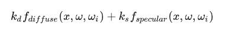
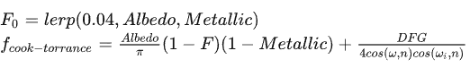
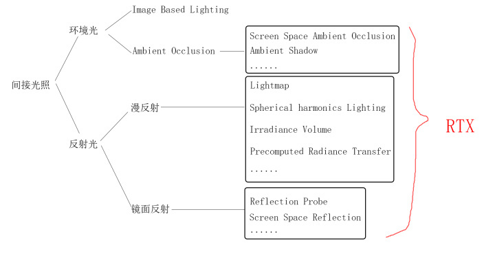
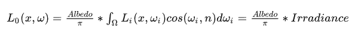

## 直接光照

在不考虑能量补偿的情况下 传统的Blinn Phong模型是

diffuse + specular + ambient

而cook-torrance BRDF的方程是



其中Ks = F, 且金属材质的漫反射为0



### 阴影

各种优化过的Shadow Map, PCF, PCSS等等

## 间接光照



间接光照与直接光照思路相同

1.   直接光源是指物体自身发出的光，比如灯泡、蜡烛、荧光棒、太阳
2.   间接光源是指物体反射出来的光，直接看图，下边的右图，两边的墙壁反射出自身的颜色，照亮了场景中的物体

那么间接光照的实现思路也是

1.  有哪些间接光源会向外发射Radiance？（找到光源）
2.  哪些方向的间接光源Radiance会到达着色点？（构建光照模型）

### 环境光

环境光包括其他物体反射的光以及所谓天空盒发出的光照

最简单的环境光可以是一个常量

```HLSL
float3 ambient = float3(0.1, 0.1, 0.1);
```

而符合物理的计算方式是基于图像的照明（**IBL**）来计算

### 漫反射部分



而Irradiance因为是低频信号可以用SH函数拟合。

其中使用PRT改进的SH就自带类似AO的效果。

### 镜面反射比较难实现

SSR是基于光线追踪的做法

### 阴影

间接光照的阴影实现比较难实现，目前较为黑科技的代表是SSAO


## [能量补偿部分](https://zhuanlan.zhihu.com/p/503998650)

后面有机会实现一下

## 参考

1.   [重新理解PBR（1） - 知乎 (zhihu.com)](https://zhuanlan.zhihu.com/p/416112744)
2.   [重新理解PBR（2）——漫反射全局光照 - 知乎 (zhihu.com)](https://zhuanlan.zhihu.com/p/452190320)
3.   [PBR渲染: Cook-Torrance的实现与补充 | Blurred code](https://www.blurredcode.com/2021/05/dec701b2/#diffusediffuse-irradiance-map)
