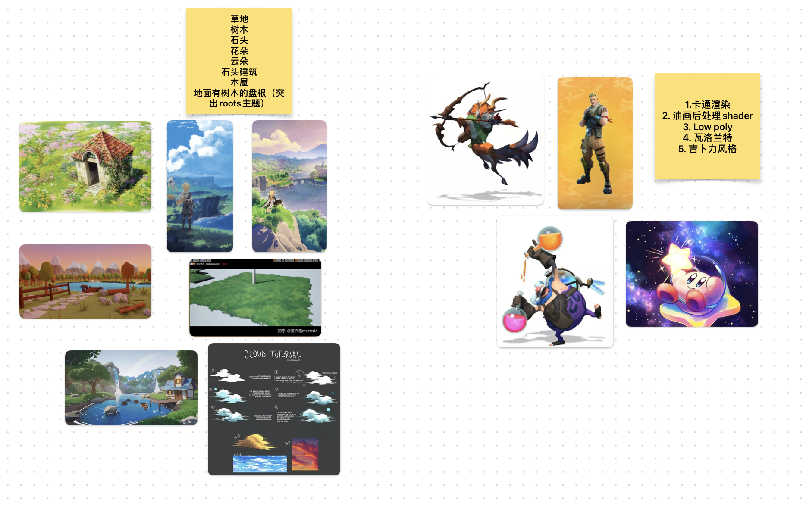

## 心得

抱歉这么晚才来写这个回顾，近期忙于过年，情人节，以及学习等等事项，年后到现在终于有一段时间相对比较安静可以回顾一下这个赛事。

首先感谢GGJ 2023能在这个时期召开，我从前公司离职到现在学习游戏制作已经有半年多的时间。一直在学习但是没有什么机会能够回顾学会什么，还欠缺什么，还想要什么。而且在这种比赛的压力下，很多问题才会暴漏出来，感谢这次能够让我总结的机会。

其次感谢我的组员：



48小时开发辛苦了，组内的除了我之外都是已经在游戏公司内工作的大佬，很高兴能与你们一起合作完成这个作品，希望我没有给你们拖后腿。

最后感谢我的女朋友，感谢她在开发前与我一起准备；开发中陪伴我并鼓励，帮我一起寻找灵感；结束后我们一起分享喜悦。她也喜欢游戏，也喜欢宫崎骏的动画。游戏场景内的部分渲染风格也是我的一点私心，希望未来有机会能构建一个独属于我们的世界。





## 技术实现

鉴于这个48小时的小项目，虽然之前一直在玩HDRP渲染管线。这次就老老实实用URP了，这也是我第一次用URP。之前在HDRP中大部分shader都用shader graph就可以完成，这次在urp中纯手写还是很有挑战性的。

整体美术风格，希望尝试一下卡通渲染。场景渲染希望借鉴吉卜力风格治愈、唯美的感觉，同时借鉴宫崎骏动画中对自然和平的追求。而人物我们选择格鲁特这一经典漫威角色，我想尝试一下厚涂风格带来的立体感。

### 找参考

背景参考，可以说是整个流程里最轻松的部分。因为我需要做的就是去看原来知名的对应题材的作品，游戏，动画，影视等。寻找其中的共同背景，色彩构成，空间元素构成。



乱糟糟随心所欲找了一些东西，也没有成体系。理想的过程是从图片总结出风格特点，再转化成引擎可以实现的方案做出来。

### 基础场景搭建

刚好在2022年底花不少精力学习和排坑的houdini PDG流程这次刚好可以应该用在这次项目中。

用houdini 生成Heightmap已经是非常轻松愉快的事情了，这个项目不需要高精度雕琢，简单调整一些细节就可以搭建PDG节点了。哦对，在这之前要在unity中准备好terrain layer以及通过随即撒点种植的植物prefab，同时设置好LOD。


---


大致流程就是在houdini中获取unity中准备好的prefab path，导出至foliage.csv中，然后把unity_instance写入prefab path属性再导入unity中cook。


用attributewrangle读取csv文件中的路径并写入撒点的s@unity_instance属性中，这一步操作很像之前在jupyter中操作csv文件。可以加一步将position,  normal, orient, pscale等属性导出Pcache，通过VFX graph制作可交互的草地（官方演示Demo）这次没有使用。


---


成品效果大致是这样，忽略这个很像ue的场景，是ECS2 input system自带的。


---


###草地渲染

目前我比较喜欢的有三种方式来制作草地。

-   第一种是terrain笔刷刷上带LOD的prefab模型，这是渲染效果最好的方案，也是成本最高的。
-   第二种是terrain笔刷刷上带LOD的prefab插片草地，效果对比第一种略显粗糙但是性能提高很多。
-   第三种来自官方的GrassWind Demo，在VFX graph中使用刚刚houdini导出的Pcache，而模型的部分可以任选模型或者插片，只是性能上的区别。

这次方案我们选择了第二种，带LOD的插片草地。插片草地的制作也很简单，在houdini中简单调整一下位置，垂直相机拍摄出texture即可。注意传递球形法线并且只保留向上的部分。


---


然后用triangulate2d 勾勒出边界并且组合成插片草模型。草地模型导入unity后关闭投射阴影，降低阴影带来的杂乱感。


---


草地渲染shader 我这次使用shader graph来制作，感谢2021.3版本的urp中支持shader graph。

把草从上到下用top color和bottom color lerp起来控制主体，随后叠加两层gradient noise从整体控制草地的颜色而不仅仅是单一模型的变化同时模拟草地整体阴影效果。Wind的vertex movment也是同理，但是这里偷懒没有做，后面有机会去实现一下。


### 树木渲染

树干的部分用half  lambert  和blinn specular实现。

```HLSL
// diffuse
half4 albedo = SAMPLE_TEXTURE2D(_MainTex, sampler_MainTex, IN.uv) * _BaseColor;

// specular
half _smoothness = SAMPLE_TEXTURE2D(_SmoothTex, sampler_SmoothTex, IN.uv).g;
half3 specular = pow(ndotH, _smoothness) * lightColor;

// lambert
half lambert = ndotL;
half halfLambert = saturate(lambert * 0.5 + 0.5);
half colorLambert = halfLambert * _ColorLambertFactor + 1 - _ColorLambertFactor;
float3 color = colorLambert * albedo + specular;
```

树叶也使用插片树叶实现，shader部分略微复杂，除了half lambert 和blinn specular以外。计算树叶自阴影增加细节。

```HLSL
half4 shadowWS = TransformWorldToShadowCoord(IN.positionWS);
half shadowAttenuation = GetMainLight(shadowWS).shadowAttenuation;
color = color * lerp(1, shadowAttenuation, _ShadowIntensity);
```

模拟投射效果，很大程度上提升树叶颜色的纯度。

```
float3 transmissionhalf = normalWS + normalize(lightDir);
float3 transmission = saturate(dot(-transmissionhalf, viewDirWS) - _TransmissionThreshold);
transmission = lerp( 1 + 0.5 * _TransmissionIntensity, 1 +_TransmissionIntensity, transmission);
color = color * transmission;
```

模拟假的SSS效果

```
half3 step1 = -1 * saturate((normalWS * _NormalInfluence * lightDir));
half4 step2 = pow(saturate(dot(step1, viewDirWS)), _SSSPower) * _SSSColor;
half4 step3 = (1 - _Thickness) * step2;color = color + step3;
```

最后的效果图如下，踩坑点，记得写阴影pass并且阴影也要alpha clip。还是比较杂乱，没有把模型导入houdini传递一下球形法线，48小时时间来不及了。

```
Pass
   {
       Name "Depth Rim"
       Tags
       {"LightMode" = "DepthOnly"}
       ZWrite On
       ColorMask 0
       Cull Off

       HLSLPROGRAM
       #pragma vertex DepthOnlyVertex
       #pragma fragment DepthOnlyFragment
       #include "Packages/com.unity.render-pipelines.universal/Shaders/LitInput.hlsl"

   TEXTURE2D(_MainTex);        SAMPLER(sampler_MainTex);
       
       CBUFFER_START(UnityPerMaterial)
           half4 _MainTex_ST;
           half _ClipValue;
       CBUFFER_END
       
       struct Attributes
       {
           float4 positionOS   : POSITION;
           float2 uv         : TEXCOORD0;
           UNITY_VERTEX_INPUT_INSTANCE_ID
       };

       struct Varyings
       {
           float2 uv           : TEXCOORD0;
           float4 positionCS   : SV_POSITION;
           UNITY_VERTEX_INPUT_INSTANCE_ID
           UNITY_VERTEX_OUTPUT_STEREO
       };

       Varyings DepthOnlyVertex(Attributes IN)
       {
           const VertexPositionInputs vertex_position_inputs = GetVertexPositionInputs(IN.positionOS);

           Varyings OUT;
           OUT.positionCS = vertex_position_inputs.positionCS;
           OUT.uv = TRANSFORM_TEX(IN.uv, _MainTex);;
           return OUT;
       }

       half4 DepthOnlyFragment(Varyings IN) : SV_TARGET
       {
           UNITY_SETUP_STEREO_EYE_INDEX_POST_VERTEX(input);
           half4 diffColor = SAMPLE_TEXTURE2D(_MainTex, sampler_MainTex, IN.uv);
           clip(diffColor - _ClipValue);
           return 0;
       }
       ENDHLSL
   }
```


---

### 人物渲染

人物渲染我用的是shader graph + custom function的方式实现。


---

大致思路与直接手写没有太大区别。首先遍历场景内的灯光（多灯光支持）获得每个灯光的颜色，方向，衰减属性用以叠加计算。光照模型用smoothstep函数控制半兰伯特模型的输出，同时设置Smooth参数来调整边界的光滑度。


---

最左边smooth = 0,  中间smooth = 0.2 右边为开启边缘光的效果。边缘光用非常偷懒的方式实现


---

### 水面渲染

用根据时间变化的gradient noise控制水面的vertex position 移动，主要用以实现小幅度的潮汐的感觉。


---

水面颜色用屏幕空间深度来控制，lerp深水区和浅水区颜色，这个实现来自unity的官方演示视频。


---

通过调整Strength和depth控制浅水和深水区


---


反射和水面波纹实现。选取两张水面法线纹理图，设置好根据时间移动的方向和速度，用reoriented normal blend的叠加方式（效果更好），用以模拟水面被风吹动的波纹。水面反射通过把刚刚的结果叠加至Screen position中，再把结果输出至Scene Color的UV中, 与给刚刚求得的深度图结果根据aplha通道进行lerp，输出至normal即可获得还算不错的具有反射效果的水面波纹。


---


最终效果如图


---

### 体积云

云直接用的cubemap贴图贴上去的skybox，48小时实在没有时间实现了


## 总结

不少内容都是临时拼凑和网上抄来的，也没有认真调整和细化方案，没有定制自己的东西。感觉还是太菜了，希望接下来继续沉下来多积累一些东西。

## 参考

1.   [风格化树——树叶分析与实现 - 知乎 (zhihu.com)](https://zhuanlan.zhihu.com/p/593500186)

2.   [水一下原神树的渲染 - 知乎 (zhihu.com)](https://zhuanlan.zhihu.com/p/482749051)

3.   [Making a Water Shader in Unity with URP! (Tutorial) - YouTube](https://www.youtube.com/watch?v=gRq-IdShxpU)

4.   [(4) Unity | Making a Lit Toon Shader in Shader Graph - YouTube](https://www.youtube.com/watch?v=FIP6I1x6lMA)

     

