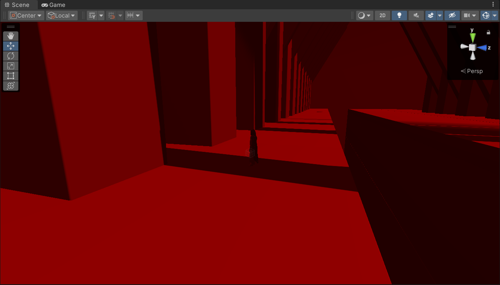

## URP 14

[URP 14](https://docs.unity3d.com/Packages/com.unity.render-pipelines.universal@14.0/manual/upgrade-guide-2022-2.html) 对应Unity 2022.2对于2021lts版本的URP 12中后处理的API有些许改变，需要参考官方文档的改变。而其中最大的改变来自于RTHandle的引入。

以一个DesaturateFeature为例。在DesaturateFeature.cs中改变比较大的是加入一个SetupRenderPasses来帮助创建Materail和传递参数，而不是传统的写法在Create()中。

```C#
    public override void SetupRenderPasses(ScriptableRenderer renderer, in RenderingData renderingData)
    {
        Material material = CoreUtils.CreateEngineMaterial(shader);
        desaturateRenderPass.ConfigureInput(ScriptableRenderPassInput.Color);
        desaturateRenderPass.Setup(material, "DesaturatedRenderPass",renderingData);
    }
```

然后写内部的DesaturateRenderPass 类。

-   变化一是RenderTargetHandle.Init("_CustomPassHandle")方式的改变为

```C#
var colorCopyDescriptor = renderingData.cameraData.cameraTargetDescriptor;
            colorCopyDescriptor.depthBufferBits = (int) DepthBits.None;
            RenderingUtils.ReAllocateIfNeeded(ref m_CopiedColor, colorCopyDescriptor, name: "_FullscreenPassColorCopy");
        
```

-   变化二：command buffer的GetTemporaryRT和ReleaseTemporaryRT被弃用。

-   官方推荐使用Blitter.BlitCameraTexture方法把原始的RT添加我们自定义的material然后再传递回去。代码实现如下

```C#
CommandBuffer cmd = CommandBufferPool.Get();
var cameraData = renderingData.cameraData;
using (new ProfilingScope(cmd, profilingSampler))
{
    var source =cameraData.renderer.cameraColorTargetHandle;
    passMaterial.SetTexture(m_BlitTextureShaderID, copiedColor);
    Blitter.BlitCameraTexture(cmd, source, copiedColor, passMaterial, 0);
    Blitter.BlitCameraTexture(cmd, copiedColor, source);
    context.ExecuteCommandBuffer(cmd);
    cmd.Clear();
}
```

参考官方的案例，完整写一个ColorTint的实例

Shader的部分可以十分简化，Vert在Blit.hlsl中官方已经帮忙处理好，这里只需要写frag的逻辑部分，太香了。

```HLSL
Shader "ColorBlit"
{
    SubShader
    {
        Tags { "RenderType"="Opaque" "RenderPipeline" = "UniversalPipeline"}
        LOD 100
        ZWrite Off Cull Off
        Pass
        {
            Name "ColorTintPass"
            HLSLPROGRAM
            #include "Packages/com.unity.render-pipelines.core/Runtime/Utilities/BlitColorAndDepth.hlsl"
            #pragma vertex Vert
            #pragma fragment frag

            float4 _ColorTint;

            half4 frag (Varyings input) : SV_Target
            {
                half4 color = FragColorAndDepth(input).color;
                color *= _ColorTint;
                return color;
            }
            ENDHLSL
        }
    }
}
```

完整的ColorTintRenderFeature部分。思路如下，用一个colorTintSettings做UI接住全部的设置内容。重写一个SetupRenderPasses来传递以前在Create()中传递的内容，创建就好好创建，设置参数就好好设置参数，嗯恒河里。RenderFeature class基本就这样没什么可以说的，与urp 12就这么点区别。哦对，在传递相机的部分，用renderer.cameraColorTargetHandle而不是cameraColorTarget。换句话说，unity 换了RThandle这个API，跟着换就行，虽然老的也能用，但是Unity官方论坛的讨论结果是未来RThandle会成为主流，你现在学会对未来没坏处。 

这里偷懒不想创建Volume，也不想多创建一个c#脚本来写colorTintPass，直接用一个intenal class来写吧。首先最大的区别就是用RThandle替代以前的API。重写OnCameraSetup()，调用ConfigureTarget()来设置当前Target，也就是刚刚传递过来的cameraColorTargetHandle。

```C#
using UnityEngine;
using UnityEngine.Rendering;
using UnityEngine.Rendering.Universal;

public class ColorTintRenderFeature : ScriptableRendererFeature
{
    [System.Serializable]
    public class ColorTintSettings
    {
        public Shader colorTintShader;
        public RenderPassEvent passEvent = RenderPassEvent.BeforeRenderingPostProcessing;
        public ScriptableRenderPassInput requirements = ScriptableRenderPassInput.Color;
        [Header("ColorTint Settings")] [Space(10)]
        public Color colorTint = Color.red;
    }
    
    public ColorTintSettings colorTintSettings = new ColorTintSettings();
    private ColorTintPass colorTintPass;

    public override void SetupRenderPasses(ScriptableRenderer renderer, in RenderingData renderingData)
    {
        colorTintPass.ConfigureInput(colorTintSettings.requirements);
        colorTintPass.Setup(renderer.cameraColorTargetHandle, colorTintSettings);
    }
    public override void Create()
    {
        colorTintPass = new ColorTintPass();
        colorTintPass.renderPassEvent = colorTintSettings.passEvent;
    }
    
    public override void AddRenderPasses(ScriptableRenderer renderer, ref RenderingData renderingData)
    {
        renderer.EnqueuePass(colorTintPass);
    }
    protected override void Dispose(bool disposing)
    {
        colorTintPass.Dispose();
    }
    
    public class ColorTintPass : ScriptableRenderPass
    {
        private ProfilingSampler profilingSampler = new ProfilingSampler(nameof(ColorTintPass));
        private ColorTintSettings colorTintSettings;
        private Material colorTintMaterial;
        private static readonly int ColorTintID = Shader.PropertyToID("_ColorTint");
        private static readonly int BlitTextureID = Shader.PropertyToID("_BlitTexture");
        private RTHandle source;
        private RTHandle copiedColor;

        public void Setup(RTHandle colorHandle, ColorTintSettings colorTintSettings)
        {
            this.colorTintSettings = colorTintSettings;
            Shader shader = colorTintSettings.colorTintShader;
            if (shader == null) 
                return;
            colorTintMaterial = CoreUtils.CreateEngineMaterial(shader);
            source = colorHandle;
        }

        public void Dispose()
        {
            source.Release();
            CoreUtils.Destroy(colorTintMaterial);
        }
        
        public override void OnCameraSetup(CommandBuffer cmd, ref RenderingData renderingData)
        {
            ConfigureTarget(source);
            var colorCopyDescriptor = renderingData.cameraData.cameraTargetDescriptor;
            colorCopyDescriptor.depthBufferBits = (int) DepthBits.None;
            RenderingUtils.ReAllocateIfNeeded(ref copiedColor, colorCopyDescriptor, name: "_FullscreenPassColorCopy");
        }

        public override void Execute(ScriptableRenderContext context, ref RenderingData renderingData)
        {
            if (colorTintMaterial == null)
                return;
            
            CommandBuffer cmd = CommandBufferPool.Get();
            var cameraData = renderingData.cameraData;
            
            using (new ProfilingScope(cmd, profilingSampler))
            {
                colorTintMaterial.SetColor(ColorTintID, colorTintSettings.colorTint);
                Blitter.BlitCameraTexture(cmd, source, copiedColor);
                colorTintMaterial.SetTexture(BlitTextureID, copiedColor);
                Blitter.BlitCameraTexture(cmd, copiedColor, source, colorTintMaterial, 0);
            }
            context.ExecuteCommandBuffer(cmd);
            cmd.Clear();
            CommandBufferPool.Release(cmd);
        }
    }
}
```

RT的初始化方法

```C#
RenderingUtils.ReAllocateIfNeeded(ref copiedColor, colorCopyDescriptor, name: "_FullscreenPassColorCopy");
```

这里偷懒直接用Blitter.BlitCameraTexture(cmd, source, source, colorTintMaterial, 0) 直接把source当作最终的RT并写入colorTintMaterial，按照逻辑的话，写成就和之前cmd.blit写出来到一个暂时的RT上再写入原source一样了。

```HLSL
Blitter.BlitCameraTexture(cmd, source, temp, colorTintMaterial, 0);
colorTintMaterial.SetColor(ColorTintID, colorTintSettings.colorTint); 
Blitter.BlitCameraTexture(cmd, temp, source);
```

最终效果如图




## 参考

1.   [Upgrading to URP 14 (Unity 2022.2) | Universal RP | 14.0.6 (unity3d.com)](https://docs.unity3d.com/Packages/com.unity.render-pipelines.universal@14.0/manual/upgrade-guide-2022-2.html)
