## 技术实现

在原神二测就有来体验过游戏，也是一步一步看着原神成长壮大封神的，一直以来都对于这样认真做内容的游戏公司怀有敬意。这次终于“敢”在掌握一定技术的情况下来模仿原神的渲染效果。

### 模型准备

模型下载自米哈游官方在B站开展的二创活动pmx格式，直接网上随便找个converter即可转为fbx方便使用，这里选择刻晴作为测试人物模型。而神奇的google有人通过神奇的方式获得其他的贴图文件。汇总起来一共获得这些文件：

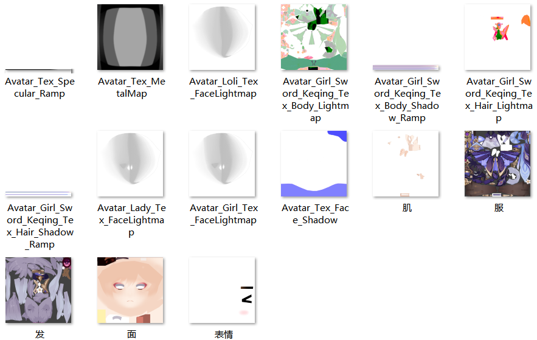


### 贴图分析

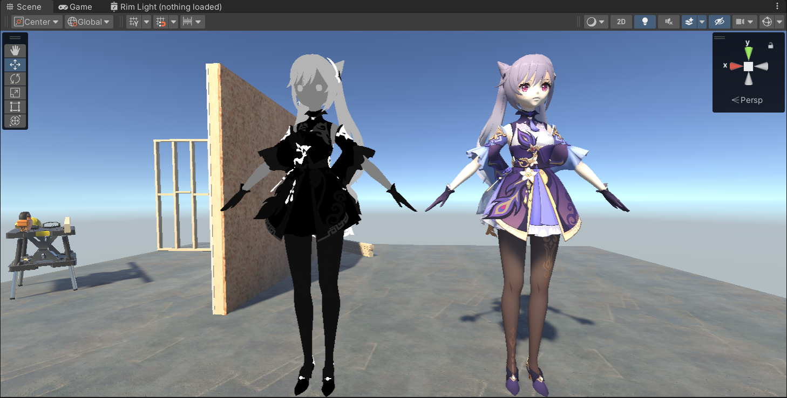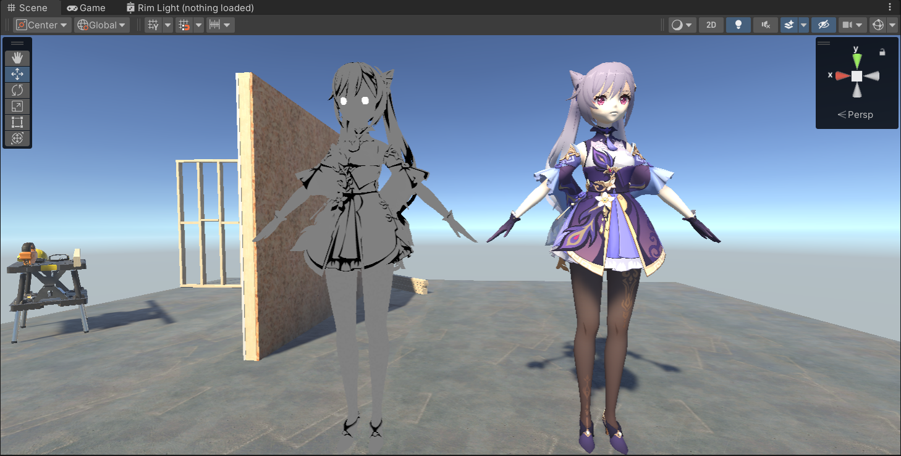

Lightmap.r = Specular Mask

Lightmap.g = AO Map

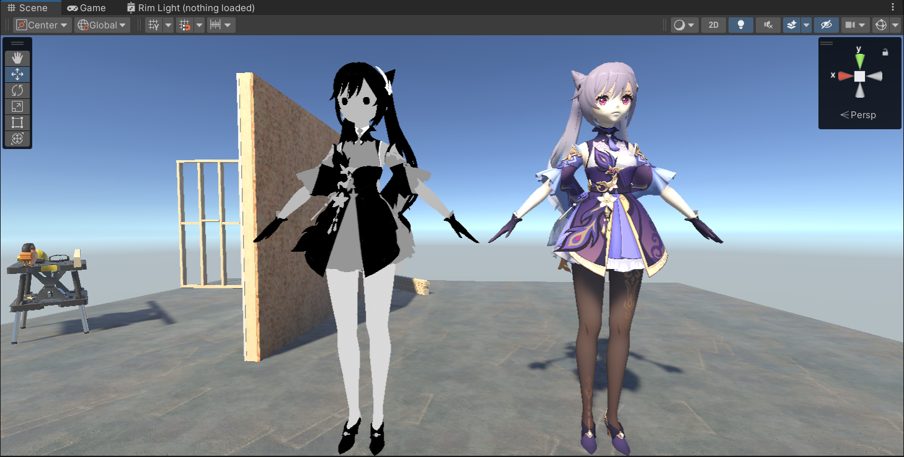

Lightmap.b = Roughness

lightmap.a = Emission Mask

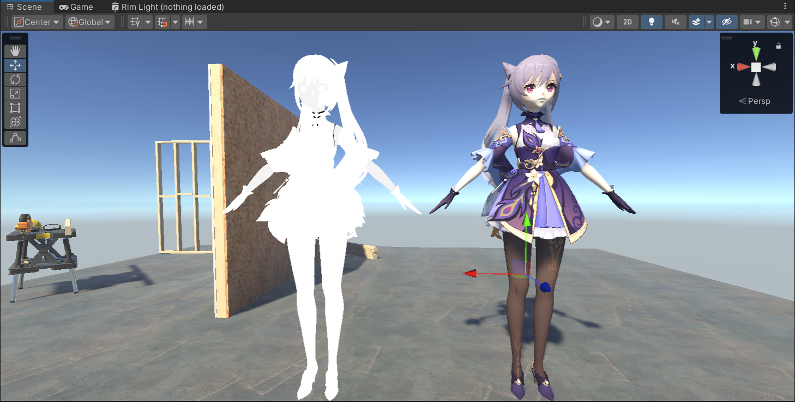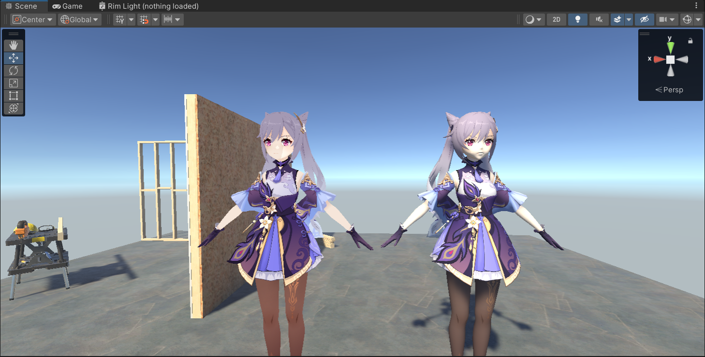

diffuse.a 在脸部，肌肉和上衣打底部分是由不为1的数值的


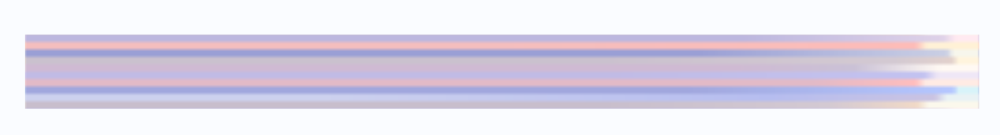

两张Ramp贴图让我想到军团要塞2中的wrapdiffuse处理，思路应该类似。而大佬们的文章表示贴图里有十条Ramp，分为上下各五条 分别对应白天和晚上。


 

### 贴图和基础计算准备

```HLSL
// Direction Function
half3 viewDirWS = GetWorldSpaceViewDir(IN.positionWS);
half3 normalWS = IN.normalWS;

// Light Calculation
Light mainLight = GetMainLight(); 
half4 lightColor = half4(mainLight.color, 1); //获取主光源颜色
half3 lightDir = normalize(mainLight.direction); //主光源方向

// Albedo
half4 albedo = SAMPLE_TEXTURE2D(_MainTex, sampler_MainTex, IN.uv); 
half4 vertexColor = IN.vertexColor; //顶点色

// Texture Sampling
// lightmap
// R channel = Specular Mask
// G channel = AO Map
// B channel = Roughness
// A channel = Emission Mask
// 灰度1.0 ： 皮肤质感/头发质感（头发的部分是没有皮肤的）
// 灰度0.7 ： 丝绸/丝袜
// 灰度0.5 ： 金属/金属投影
// 灰度0.3 ： 软的物体
// 灰度0.0 ： 硬的物体
half4 lightMap = SAMPLE_TEXTURE2D(_LightMap, sampler_LightMap, IN.uv); 

// Dot Product Function
half ndotL = max(0, dot(normalWS, lightDir));
half ndotH = max(0, dot(normalWS, normalize(viewDirWS + lightDir)));
half ndotV = max(0, dot(normalWS, viewDirWS));
half ndotU = max(0, dot(normalWS, (0, 1.0, 0)));
```

### Adjusted HalfLambert

基础的半兰伯特模型，加上用定点色做调整。

```HLSL
//lambert
half lambert = ndotL;
half lambertAO = lambert * saturate(lightMap.g * 2);
half lambertRampAO = smoothstep(0, _ShadowSmooth, lambertAO);

// using vertex color as an offset to adjust half lambert sampling
half halfLambertAO = saturate(lambertRampAO * _WrapDiffuse + 1 - _WrapDiffuse);
half vertexOffset = step(0.5, vertexColor) == 1 ? vertexColor : 1 - vertexColor;
half adjustedHalfSampler = saturate(halfLambertAO * vertexOffset);
```

这里 AO的地方自定义（lightmap.g ）乘2用来获得对比度更加明显的AO效果_ShadowSmooth 用来调整亮部到暗部过度的明显程度，左边0.5，右侧1.0。

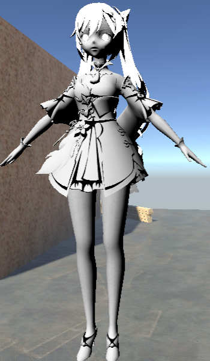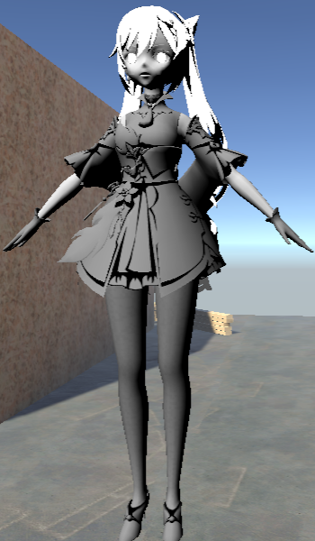


### Wrapped Diffuse

回顾一下军团要塞2中Ramp使用方式

```HLSL
half4 ramp = SAMPLE_TEXTURE2D(_RampMap, sampler_RampMap, half2(halfLambert, 0));
```

原神的衣服整体并不受环境光颜色直接影响，这里面需要计算是否是白天或者夜晚。

```HLSL
// Day (0.5) or Night(0)
half dayOrNight = (1 - step(0.1, _IsNight)) * 0.5 + 0.03;

// diffuse = ramp + adjusted half lambert + AO
half rampV = saturate(lightMap.a * 0.45 + dayOrNight);
half2 rampUV = half2(adjustedHalfSampler, rampV);
```

把ramp的V方向取值，0-0.5为 黑天，0.5-1为白天，取代军团要塞中V方向只有单条ramp取值。

### Specular

金属部分使用到metalMap高光，实现原理来自MatCap采样。

```HLSL
// Metal Specular
half metalMask = step(0.95, lightMap.r);
half3 cameraForward = -viewDirWS;
half3 viewUpDir = mul(UNITY_MATRIX_I_V, half4(0, 1, 0, 0)).xyz;
half3 cameraRight = SafeNormalize(cross(viewUpDir, cameraForward));
half3 cameraUp = SafeNormalize(cross(cameraForward, cameraRight));
half2 metalMapUV = mul(half3x3(cameraRight, cameraUp, cameraForward), normalWS).xy * 0.49 + 0.5;
half4 metalMap = SAMPLE_TEXTURE2D(_MetalMap, sampler_MetalMap, metalMapUV);
half4 metalSpecular = _MetalIntensity * metalMap * metalMask * albedo;
```

非金属部分使用常规的Blinn Phong高光

```
half Ks = 0.96;
half  SpecularPow = exp2(lightMap.r * 11.0 + 2.0);
half  SpecularNorm = (SpecularPow + 8.0) / 8.0;
half4 SpecularColor = albedo * lightMap.g;
half SpecularContrib = albedo * (SpecularNorm * pow(ndotH, SpecularPow));
half4 nonMetalSpecular = SpecularColor * SpecularContrib  * ndotL* Ks * lightMap.b;
```

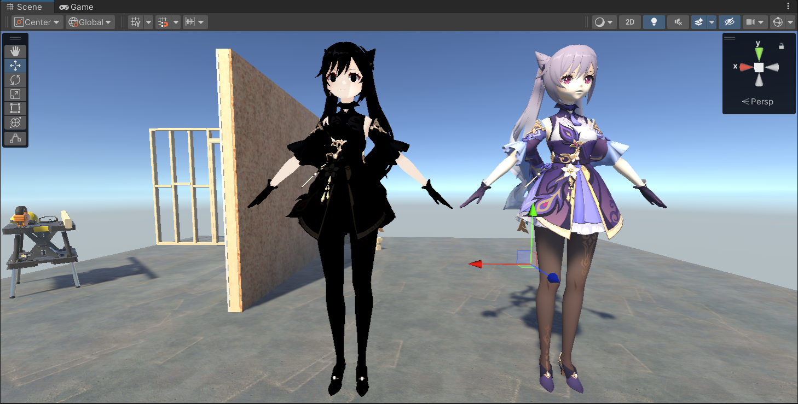

---

自发光

这里我用自发光来描绘裸漏皮肤以及丝袜部分SSS材质的效果

```HLSL
// Emission (Fake SSS)
half emissionMask = albedo.a;
emissionMask *= step(0.65, lightMap.a);
// half time =  abs((frac(_Time.y * 0.5) - 0.5) * 2);
half4 emission = albedo * lightColor * emissionMask * _EmissionIntensity * _EmissionColor;
```

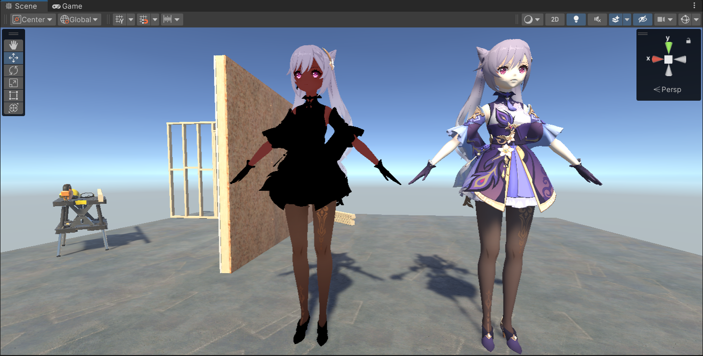

---


### Outline

多开一个pass，平滑法线后back face沿着法线方向平移，都是基础做法。其实也可以用后处理来做。但是URP 2022才支持不用写后处理脚本，直接贴matertial上去，后面在尝试做一版吧。

```HLSL
Pass 
{
    Name "OutLine"
    Tags {"LightMode" = "SRPDefaultUnlit"}
    Cull front
    HLSLPROGRAM
    #pragma vertex vert  
    #pragma fragment frag

    Varyings vert(Attributes IN) {
        half4 scaledScreenParams = GetScaledScreenParams();
        half ScaleX = abs(scaledScreenParams.x / scaledScreenParams.y);

        Varyings OUT;
        VertexPositionInputs vertexInput = GetVertexPositionInputs(IN.positionOS.xyz);
        VertexNormalInputs normalInput = GetVertexNormalInputs(IN.normal);
        half3 normalCS = TransformWorldToHClipDir(normalInput.normalWS);
        half2 extendDis = normalize(normalCS.xy) * (0.1 * 0.01);
        extendDis.x /=ScaleX ;
        OUT.positionCS = vertexInput.positionCS;
        OUT.positionCS.xy +=extendDis;
        return OUT;
    }

    half4 frag(Varyings IN) : SV_Target {
        return float4(0, 0, 0, 1);
    }

    ENDHLSL
}	
```

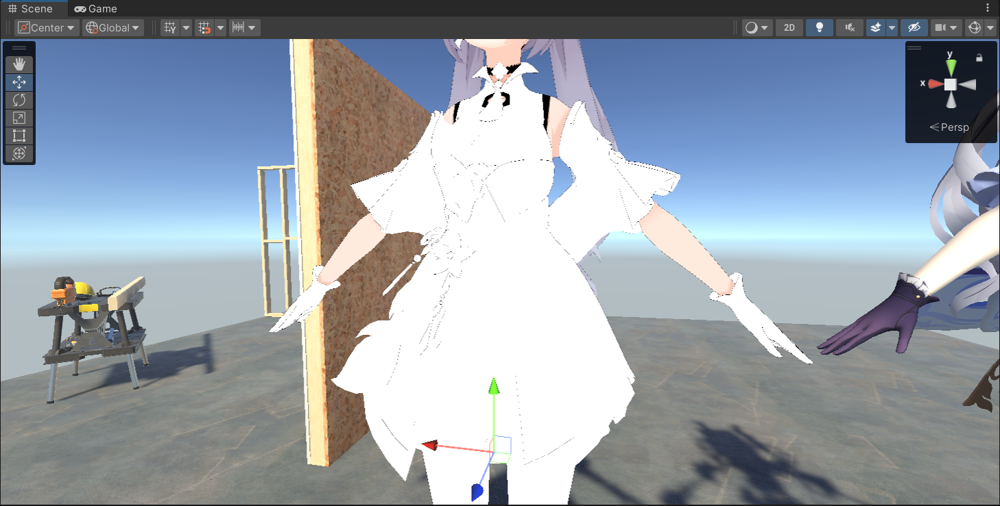

---


## 暂时效果


还缺少深度空间边缘光，哦对头发的高光也应该额外处理，留个坑以后去实现。

## 参考

1.   [【01】Unity URP 卡通渲染 原神角色渲染记录-Diffuse: Ramp + AO + Double Shadow - 知乎 (zhihu.com)](https://zhuanlan.zhihu.com/p/551104542)
2.   [【Unity技术美术】 原神Shader渲染还原解析 - 知乎 (zhihu.com)](https://zhuanlan.zhihu.com/p/435005339)
3.   [[卡通渲染\]二、原神角色渲染还原 - Diffuse-1 - 知乎 (zhihu.com)](https://zhuanlan.zhihu.com/p/547129280)
4.   [原神角色渲染Shader分析还原 - 知乎 (zhihu.com)](https://zhuanlan.zhihu.com/p/360229590)
5.   [【02】从零开始的卡通渲染-着色篇1 - 知乎 (zhihu.com)](https://zhuanlan.zhihu.com/p/110025903)
6.   [[卡通渲染\]等宽屏幕空间边缘光 - 知乎 (zhihu.com)](https://zhuanlan.zhihu.com/p/551629982)
