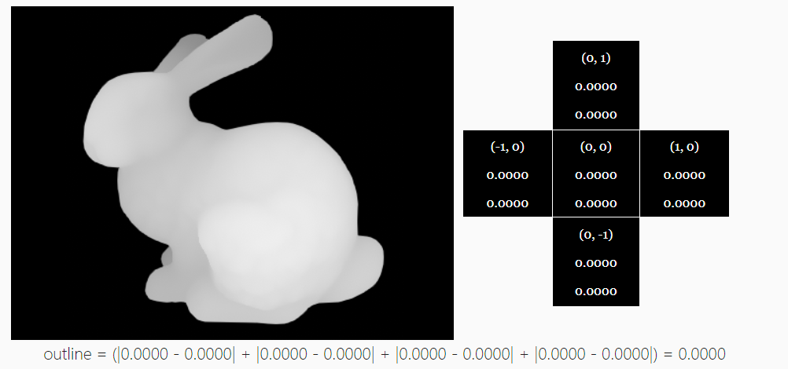
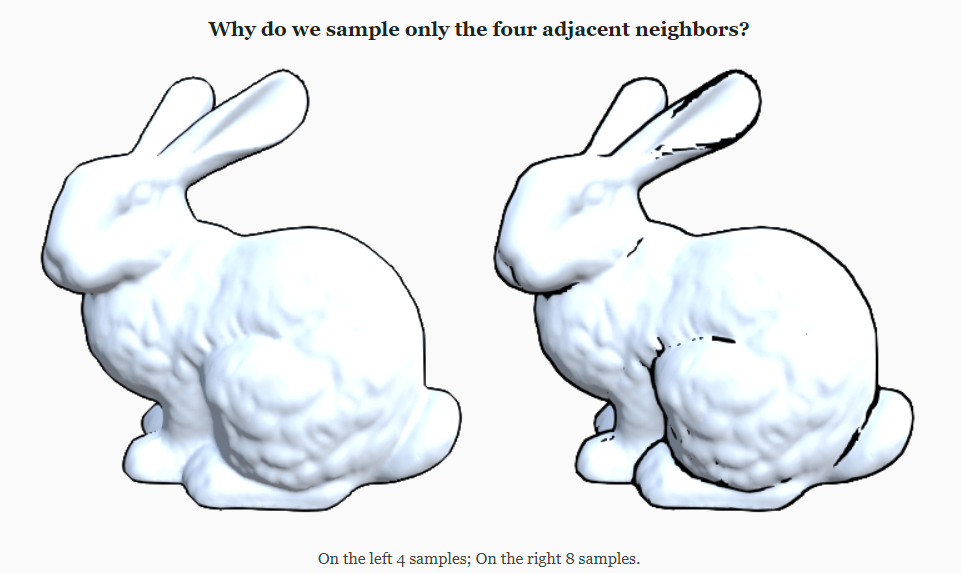
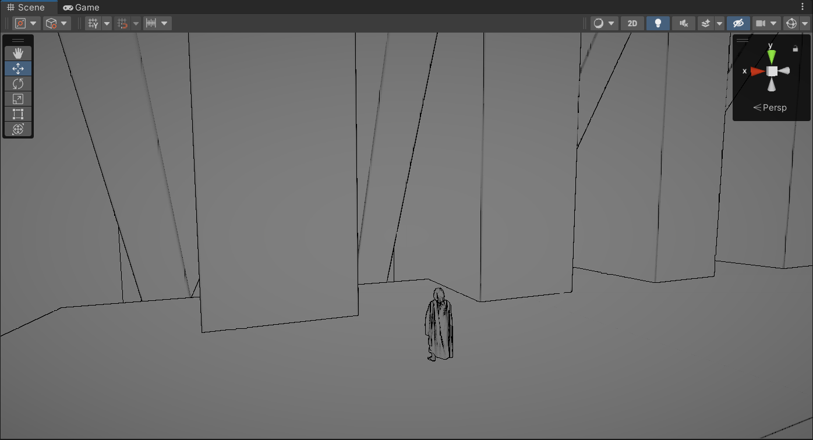

## 什么是边缘检测

根据Wiki说明，边缘检测是一种用于识别图像变化的明显的区域的技术。因此这种基础技术被广泛应用与图像处理和计算机视觉中用以查找出物体的边缘。边缘检测算法的目的是发掘图像中不连续火图像亮度急剧变化的点。而常见的几种算法用于便边缘检测技术包括Sobel， Prewitt, Roberts 和 Canny。其中Canny 边缘检测器是罪被广泛应用的算法，它使用多阶算法结合，于1986年被John F. Canny最先开发出来并且随后广泛使用。

## 为什么边缘检测重要

边缘检测是图像处理的重要组成部分，因为它有助于计算识别和将图像分离成不同的部分 。 它用于图像处理、计算机视觉和机器视觉等领域的图像分割和数据提取。 检测图像亮度的急剧变化的目的是捕捉重要事件和属性的变化。 边缘是与图像相关的最重要的特征之一。 我们通过图像的边缘了解图像的底层结构。 因此，计算机视觉处理管道广泛使用边缘检测。

## Sobel 边缘检测



简单地说，我们对每个片段的四个边邻居进行采样，并对采样属性的差异求和。 小的差异表明表面是一致的，我们很可能不在边缘上，而大的差异表明采样属性的突然变化，我们很可能在边缘像素上。

我们将用来计算 Sobel 差分的函数可以表示为： 

-   s为纹理样本，是原像素点的位置
    -   中、上、下、左、右
-    multiplier 是一个标量输入控制参数
-   线性影响值 bias 是一个标量输入控制参数，用于减少最终结果中的噪声伪影

## URP代码实现

URP中需要在custompass中开启Scene normal的支持，方法参考官方实现的SSAO效果。

```HLSL
ConfigureInput(ScriptableRenderPassInput.Normal);
```

在Shader中便可以对CameraNormalsTexture采样

```HLSL
#include "Packages/com.unity.render-pipelines.universal/ShaderLibrary/DeclareNormalsTexture.hlsl"
float4 SampleNormal(float2 uv)
{
	return SAMPLE_TEXTURE2D(_CameraNormalsTexture, sampler_CameraNormalsTexture, uv);
}
```

对法线和深度采样的方式几乎完全相同，采样法线和深度两种方式

```HLSL
float4 SobelSampleNormal(float2 uv, float3 offset)
{
    float4 pixelCenter = SampleNormal(uv);
    float4 pixelLeft = SampleNormal(uv - offset.xz);
    float4 pixelRight = SampleNormal(uv + offset.xz);
    float4 pixelUp = SampleNormal(uv + offset.zy);
    float4 pixelDown = SampleNormal(uv - offset.zy);

    return abs(pixelLeft - pixelCenter) +
        abs(pixelRight - pixelCenter) +
        abs(pixelUp - pixelCenter) +
        abs(pixelDown - pixelCenter);
}
```

只使用邻近的四个的原因是为了减少不必要的边缘检测




完成 SobelDepth 和SobelNormal的计算后，将两种采样结果合并

```HLSL
float sobelOutline = saturate(max(sobelDepth, sobelNormal));
```

此时还需要处理一些缺陷

1.   物体与物体连接处没有边缘
2.   视线与物体夹角较小，接近平视时因为像素的问题会导致一部分物体表面都会出现描边颜色而不是很细的线。



Reference 

1.   [Sobel Outline with Unity Post-Processing · Vertex Fragment](https://www.vertexfragment.com/ramblings/unity-postprocessing-sobel-outline/)
2.   [URP Sobel Edge Detection (github.com)](https://gist.github.com/Kampter/735105576b7df2b4577ab479e528bdab)
3.   https://www.youtube.com/watch?v=LMqio9NsqmM&t=4s