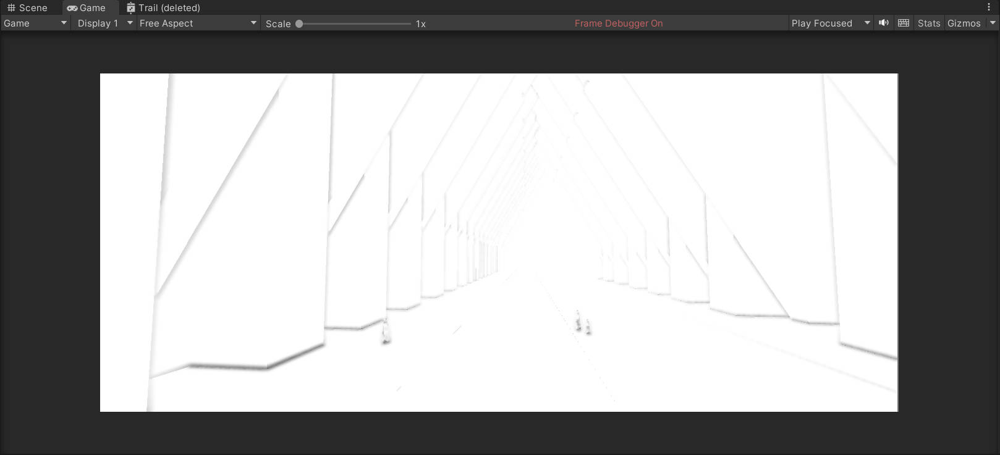

# Screen Space Ambient Occlusion: Enhancing Realism in Video Games

## Introduction

Video games have come a long way since their inception, and the quality of graphics has improved significantly. One aspect that helps in achieving realistic visuals in video games is Screen Space Ambient Occlusion (SSAO). SSAO is a technique that enhances the depth and realism of the game by simulating the way light behaves in real life. In this blog post, we will discuss what SSAO is, how it works, its benefits in video games, and how it can be implemented.

## What is Screen Space Ambient Occlusion?

Screen Space Ambient Occlusion is a technique used in video games to simulate the way light interacts with objects in real life. In video games, SSAO is used to enhance the depth and realism of the game by simulating the shadows that are created when light is blocked by objects. SSAO calculates the amount of ambient light that reaches a pixel on the screen by taking into account the occlusion of that pixel by surrounding objects.

## How Does Screen Space Ambient Occlusion Work?

SSAO works by analyzing the depth and normal information stored in the game's frame buffer. The technique calculates the amount of ambient light that should be reaching a pixel by analyzing the surrounding pixels. SSAO simulates the way light behaves in real life by taking into account the occlusion of a pixel by surrounding objects. By adding shadows to the game, SSAO enhances the depth and realism of the game's graphics.

## Benefits of Screen Space Ambient Occlusion

The use of SSAO in video games has several benefits. Firstly, it enhances the realism of the graphics by simulating the way light behaves in real life. This makes the game world feel more immersive, and the player feels more connected to the game. Secondly, SSAO adds depth to the game by simulating the way shadows are created when light is blocked by objects. This adds a sense of realism to the game world, making it feel more natural. Lastly, SSAO is a relatively inexpensive technique that can be used in real-time applications, making it a popular choice among developers.

## Implementing SSAO in Video Games

Implementing SSAO in video games can be done using different techniques. Here are some of the most common methods used by game developers:

### Screen Space Ambient Occlusion

Screen Space Ambient Occlusion is the most common method used by game developers. This technique uses the depth and normal information stored in the game's frame buffer to calculate the amount of ambient light that should be reaching a pixel. SSAO is then applied to the pixel to simulate the way light behaves in real life.

### Horizon-Based Ambient Occlusion

Horizon-Based Ambient Occlusion is a technique that takes into account the horizon of the game world. This technique calculates the amount of ambient light that should be reaching a pixel by analyzing the distance between the pixel and the horizon. This method is more computationally expensive than SSAO but provides more accurate results.

### Multi-Scale Ambient Occlusion

Multi-Scale Ambient Occlusion is a technique that uses different scales to calculate the amount of ambient light that should be reaching a pixel. This method takes into account the distance between the pixel and the objects in the game world to provide more accurate results.

When implementing SSAO, it is essential to consider the limitations of the technique. SSAO may not be effective in simulating the way light behaves in open spaces or in situations where the light source is very bright. It can also create artifacts in the game world, such as halos around objects. To overcome these limitations, game developers can use other techniques such as Horizon-Based Ambient Occlusion or Multi-Scale Ambient Occlusion.

## Limitations of SSAO

While SSAO is a useful technique for enhancing the realism of video games, it does have its limitations. SSAO is only effective in simulating the way light behaves in real life in certain situations. For example, SSAO is not effective in simulating the way light behaves in open spaces or in situations where the light source is very bright. In addition, SSAO can sometimes create artifacts in the game world, such as halos around objects.

## Future of SSAO

Despite its limitations, SSAO is becoming an essential technique for game developers looking to create realistic graphics in their video games. As technology continues to improve, it is likely that SSAO will become more effective in simulating the way light behaves in real life. With the increasing demand for realistic graphics in video games, game developers will continue to rely on SSAO and other techniques to enhance the depth and realism of their games.

## Conclusion

Screen Space Ambient Occlusion is a technique that enhances the realism of video games by simulating the way light behaves in real life. SSAO works by analyzing the depth and normal information stored in the game's frame buffer and calculating the amount of ambient light that should be reaching a pixel. The use of SSAO in video games has several benefits, including enhancing the realism and depth of the game world. While SSAO does have its limitations, it is becoming an essential technique for game developers looking to create realistic graphics in their video games. With its increasing popularity, it is important for game developers to continue to explore and experiment with SSAO to create even more realistic and immersive gaming experiences for players.

## 闲言闲语

以上内容使用notion AI创作完成，刚好近期AIGC火的一塌糊涂，诸如Midjourney, Stable diffusion, 还有ChatGPT等等，以及很多大厂在GDC上面分享了由AI帮助生产的技术。我们也来凑个热闹好了。其实不难看出，AI在讲述一个完全未知效果的时候还挺好用的。一板一眼，条条框框，逻辑十分正确，至少比我强多了。而SSAO到底是什么，以及怎么实现，其实在上述内容已经讲的很清楚了。这里用中文列出来：

1.   获取屏幕空间深度
2.   根据相机的世界位置，深度，就可以重建整个世界空间
3.   URP下面没有法线图，构建法线的内容参考 

>   https://wickedengine.net/2019/09/22/improved-normal-reconstruction-from-depth/

4.   在法线的方向的半球内随机撒点，点尽可能靠近像素中心位置。
5.   构建像素点至随机点的向量，并转化至View 空间
6.   对比depth 和构建的向量的深度，计算这个向量是否被遮挡。
7.   加权平均半球内的全部随机点结果，取值缩放至 0 - 1范围内，即遮蔽效果的强度。

## Reference

1.   https://www.yuque.com/yikejinyouzi/aau4tk/gs7n7d#u7t1x
2.   https://wickedengine.net/2019/09/22/improved-normal-reconstruction-from-depth/
3.   https://atyuwen.github.io/posts/normal-reconstruction/
4.   https://github.com/sebastianhein/urp-ssao/blob/master/Shaders/ssao.shader