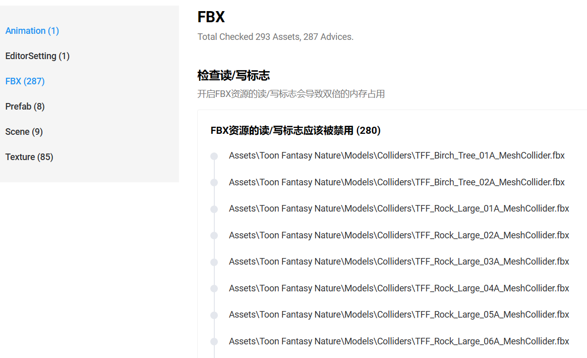
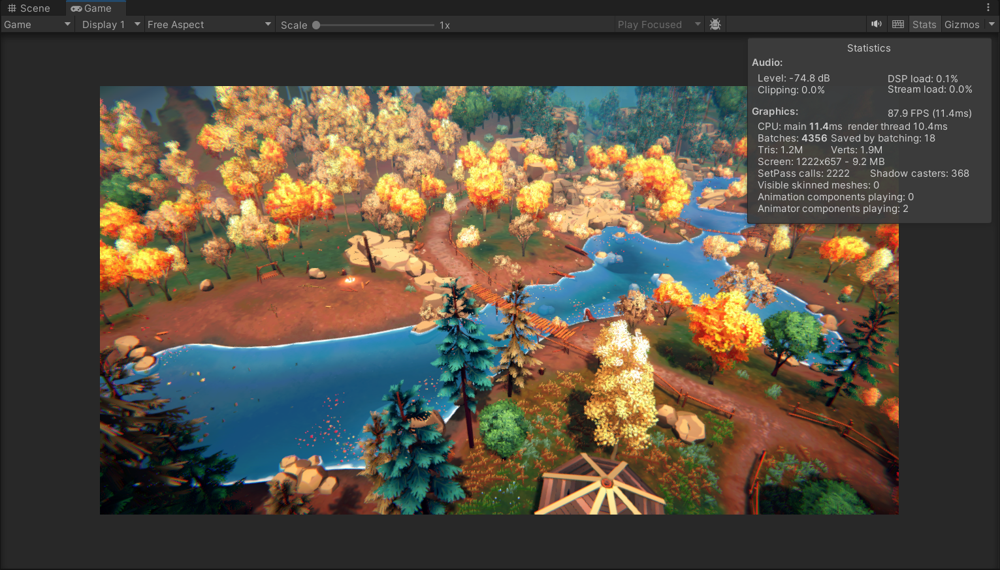
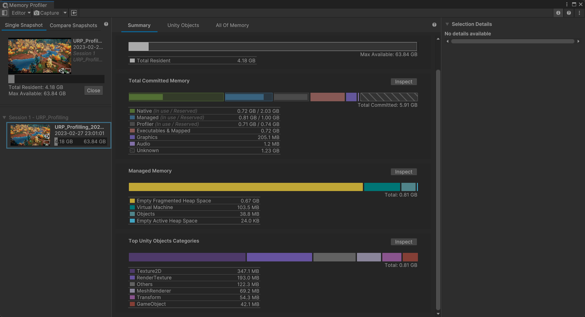

## 资产说明

这次使用的全部资产来自[Toon Fantasy Nature](https://assetstore.unity.com/packages/3d/environments/landscapes/toon-fantasy-nature-215197) 这个Pacakage，直接使用下面的的Lake 01场景，原价是比较贵的，刚刚参加的Game Jam有优惠，几个特效，场景，人物还有音频等等资产加起来不到20刀还是蛮划算的，谢谢Unity。

## UPR

使用Unity官方自带的检测工具过一遍全部的资产，先用[AssetChecker Win](https://upr.unity.cn/instructions/assetchecker)过一遍总览一下有哪些问题。

使用方式也非常简单，直接查看用户手册即可，这工具绿色好用，真心点赞。

```shell
.\assetcheck.exe --project=<project_path> --projectId=<project_id>
```

<project_path>为Unity工程所在路径，<project_id>为UPR项目Id。

<project_id>非必需项。如果填写了<project_id>，检测结束后，可直接在UPR网站该项目内查看检测结果。



运行游戏看一下效果



看一下内存占用情况




---未完待续---
