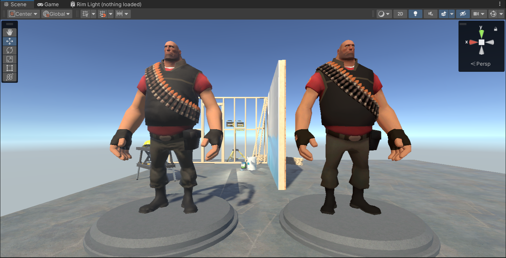
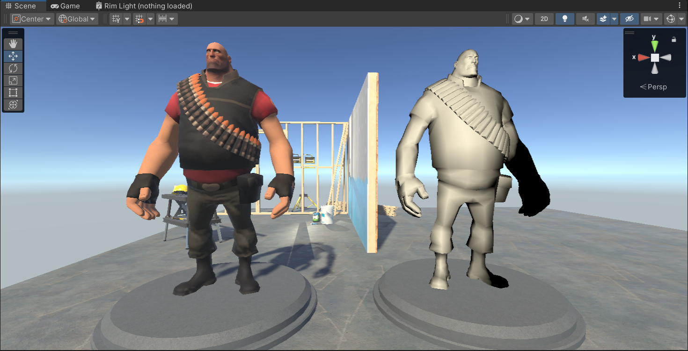

## 技术分析

论文中有一篇非常形象的图片来实现渲染效果


### Albedo

```HLSL
// Albedo
half4 mainTex = SAMPLE_TEXTURE2D(_MainTex, sampler_MainTex, IN.uv) * _MainColor;
half4 albedo = mainTex;
half4 ambient = half4(unity_SHAr.w, unity_SHAg.w, unity_SHAb.w, 1.0);
```

直接采样人物的贴图，顺手再把其他的贴图也一并采样进来。


---


### Wraped diffuse

论文中的光照实现公式为


在unity实现中使用ramp的方式即采样ramp时的uv 参数用halfLambert 组成的X分量，叠加上主光源即可。

```
// Half Lambert
half ndotL = max(0, dot(normalWS, lightDir));
half lambert = ndotL;
half halfLambert= saturate(lambert * 0.5 + 0.5);
half4 ramp = SAMPLE_TEXTURE2D(_RampMap, sampler_RampMap, half2(halfLambert, 0));
half4 wrapDiffuseTerm = ramp * lightColor;
```


---


### Ambient 

ambient实现比较复杂，这里直接抄unity urp中关于SH 求谐函数的代码

```HLSL
real3 SH_indirectDiffuse(real3 normalWS, real AO)
{
    real4 SHCoefficients[7];
    SHCoefficients[0] = unity_SHAr;
    SHCoefficients[1] = unity_SHAg;
    SHCoefficients[2] = unity_SHAb;
    SHCoefficients[3] = unity_SHBr;
    SHCoefficients[4] = unity_SHBg;
    SHCoefficients[5] = unity_SHBb;
    SHCoefficients[6] = unity_SHC;
    real3 color = SampleSH9(SHCoefficients, normalWS);
    return max(0, color) * AO;
}
```


---


### View Independent Lighting Terms

```HLSL
half3 viewIndependentLightTerms = albedo * (indirectDiffuse+ wrapDiffuseTerm);
```



---


### View Dependent Lighting Terms

论文中计算依赖视角的光照部分的公式


在依赖视角的光照部分中，《军团要塞2》除了考虑一般的Phong高光外，还基于菲涅尔现象实现了类似边缘光的效果。Specular就是式子中的左半部分，Rim lighting就是式子中的右半部分。

原版实现代码如下

```HLSL
//计算View Independent Lighting Terms
half3 viewIndependentLightTerms = albedo * (indirectDiffuse+ wrapDiffuseTerm);

// Specular
half fs = _FresnelSpecular;
half4 spec = fs * pow(ndotH, smoothness);
half4 specular = pow(spec, _KSpecular)* _SpecularColor * metalMask;

// Rim Lightingw
half kr = 0.5;
half fr = pow(1 - ndotV, 4);
half4 rim = kr * fr * pow(spec, _RimPower);

// Dedicated Rim Lighting 
half4 aV = half(1);
half4 dedicatedRimLighting = ndotU * fr * kr * aV;

// Multiple Phong Terms
half ks = 1;
half4 multiplePhongTerms = ks * lightColor * max(specular, rim);
half4 viewDependentLightTerms = multiplePhongTerms + dedicatedRimLighting;
```


参考没有遮罩的时候，转换成另一种算法，同时替代phong高光为blinn phong。

添加Fresnel 效果的 multiplePhongTerms 高光模型

```HLSL
// 计算View dependent Lighting Terms
half halfVector = normalize(viewDirWS + lightDir);
half3 specular = pow(ndotH, 1);
half fresnel = pow(1 - dot(viewDirWS, halfVector), 5.0);
fresnel += 0.5 * (1.0 - fresnel);
half3 multiplePhongTerms = specular * fresnel * lightColor;
```



---


### Rim Light 实现 

```HLSL
half rim = 1.0 - saturate(ndotV);
half3 dedicatedRimLighting = _RimLightColor * pow(rim, _RimPower);
```


---


## 合成效果

```HLSL
half3 viewDependentLightTerms = albedo * lightColor * max(multiplePhongTerms, dedicatedRimLighting);

// Combine
half3 color = viewIndependentLightTerms + viewDependentLightTerms;
```


---


哦豁打完收工，忽略没有写投影pass。wrapped diffuse的效果提供明暗交界处有明显的泛红。

## 参考

1.   [NPAR07_IllustrativeRenderingInTeamFortress2.pdf (akamaihd.net)](https://steamcdn-a.akamaihd.net/apps/valve/2007/NPAR07_IllustrativeRenderingInTeamFortress2.pdf)
2.   [《军团要塞2》卡通渲染算法实现 - Richbabe的博客 | Richbabe Blog](http://richbabe.top/2018/12/12/军团要塞2-卡通渲染算法实现/)
3.   [【Shader拓展】Illustrative Rendering in Team Fortress 2_妈妈说女孩子要自立自强的博客-CSDN博客](https://blog.csdn.net/candycat1992/article/details/37696187)
4.   [Shader - Specular Term - Fresnel — polycount](https://polycount.com/discussion/94026/shader-specular-term-fresnel)
