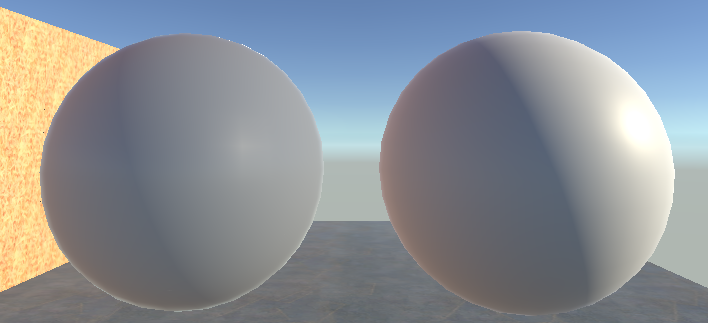

## 技术实现

Unity 自带的Lit 采用了通用的microfacet Cook-Torrance BRDF着色模型，对于各向异性，清漆，布料等支持并没有实现。这里希望搭建一个Disney Principled BRDF 来学习源码并且扩充这部分shader便于以后风格化定制。

### Diffuse项实现

```HLSL
half3 Disney_Diffuse(half3 diffuseColor, half roughness, half ndotV, half ndotL, half LdotH)
{
 half FD90 = 0.5 + 2 * LdotH * LdotH * roughness;
 half FnV = SchlickFresnel(ndotV);
 half FnL = SchlickFresnel(ndotL);
 return  lerp(1.0, FD90, FnV) * lerp(1.0, FD90, FnL);
}
```

unity实现如下，但是UE把LdotH修改成VdotH

```HLSL
half3 Diffuse_Burley_Disney(float3 diffuseColor, float roughness, float ndotV, float ndotL, float LdotH)
{
 float FD90 = 0.5 + 2 * LdotH * LdotH * roughness;
 float FdV = 1 + (FD90 - 1) * Pow5(1 - ndotV);
 float FdL = 1 + (FD90 - 1) * Pow5(1 - ndotL);
 return diffuseColor * ((1 / PI) * FdV * FdL);
}
```


UE的修改会造成远距离看diffuse模型变成一个没有明暗区分的模型。


这与Disney的效果十分接近



### 完整代码

偷懒没有逐一贴过来，完整写完直接代码在这里。

```HLSL
Shader "Custom/Disney PBR"
{
    Properties
    {   
        //Disney coefficients
        [MainTexture] _BaseMap   ("Base Color", 2D)                  = "white" {}
        _MainColor               ("Color Tint", Color)               = (1.0, 1.0, 1.0, 1.0)
        _Metallic                ("Metallic", Range(0, 1))           = 0.0
        _Smoothness              ("Smoothness", Range(0, 1))         = 0.5
        _Subsurface              ("Subsurface", Range(0, 1))         = 0.0
        _Specular                ("Specular", Range(0, 1))           = 0.5
        _SpecularTint            ("SpecularTint", Range(0, 1))       = 0.0
        _Anisotropic             ("Anisotropic", Range(0, 1))        = 0.0
        _Sheen                   ("Sheen", Range(0, 1))              = 0.0
        _SheenTint               ("SheenTint", Range(0, 1))          = 0.5
        _Clearcoat               ("Clearcoat", Range(0, 1))          = 0.0
        _ClearcoatGloss          ("ClearcoatGloss", Range(0, 1))     = 0.0

        //Normal control
        _BumpScale               ("Normal Scale", Range(0, 1))       = 1.0
        _BumpMap                 ("Normal Map", 2D)                  = "bump"  {}

        //GI control
//        _IrradianceMap           ("Irradiance Map", CUBE)            = "white" {}
        _LUT                     ("LUT", 2D)                         = "white" {}
//        _PrefilterMap            ("Prefilter Map", CUBE)             = "white" {}
//        _AO                      ("AO", 2D)                          = "white" {}
    }
    SubShader
    {
        Tags { "RenderType"="Opaque" "RenderPipeLine"="UniversalRenderPipeline" "IgnoreProjector" = "True" }
        HLSLINCLUDE

        #include "Packages/com.unity.render-pipelines.universal/ShaderLibrary/Core.hlsl"
        #include "Packages/com.unity.render-pipelines.universal/ShaderLibrary/Lighting.hlsl"
        
        TEXTURE2D(_BaseMap);        SAMPLER(sample_BaseMap);
        TEXTURE2D(_BumpMap);        SAMPLER(sampler_BumpMap);
        TEXTURE2D(_LUT);            SAMPLER(sampler_LUT);
        
        CBUFFER_START(UnityPerMaterial)
            half4 _BaseMap_ST;
            half4 _MainColor;
            half _Metallic;
            half _Smoothness;
            half _Subsurface;
            half _Specular;
            half _SpecularTint;
            half _Anisotropic;
            half _Sheen;
            half _SheenTint;
            half _Clearcoat;
            half _ClearcoatGloss;
            half4 _BumpMap_ST;
            half _BumpScale;
            half4 _LUT_ST;
        CBUFFER_END

        struct Attributes
        {
            half4 positionOS    : POSITION;
            half3 normalOS      : NORMAL;
            half4 tangetOS      : TANGENT;
            half2 uv            : TEXCOORD0;
            half2 lightmapUV    : TEXCOORD1;
            UNITY_VERTEX_INPUT_INSTANCE_ID
        };

        struct Varyings
        {
            half4 positionCS    : SV_POSITION;
            half3 positionWS    : TEXCOORD0;
            half3 normalWS      : TEXCOORD1;
            half2 uv            : TEXCOORD2;
            half3 tangentWS     : TEXCOORD3;
            half2 lightmapUV    : TEXCOORD4;
            half3 bitangentWS   : TEXCOORD5;
            half4 viewDirWS     : TEXCOORD6;
            half  fogCoord      : TEXCOORD7;
            UNITY_VERTEX_INPUT_INSTANCE_ID
        };

        ENDHLSL

        Pass 
        {   
            Name "DisneyForward"
            Tags{ "LightMode"="UniversalForward" }
            
            CULL OFF
            HLSLPROGRAM
            #pragma vertex vert
            #pragma fragment frag
            #pragma multi_compile_fog
            #pragma shader_feature_local_fragement _EMISSION

            #define _NORMALMAP

            Varyings vert(Attributes IN)
            {
                Varyings OUT = (Varyings)0;
                UNITY_SETUP_INSTANCE_ID(IN);
                UNITY_TRANSFER_INSTANCE_ID(IN, OUT);
            
                const VertexPositionInputs vpi = GetVertexPositionInputs(IN.positionOS);
                const VertexNormalInputs vni = GetVertexNormalInputs(IN.normalOS, IN.tangetOS);
                // get positive or negative normal signal (should be either 1 or -1)
                half sign = IN.tangetOS.w * GetOddNegativeScale();
                
                OUT.positionWS = vpi.positionWS;
                OUT.positionCS = vpi.positionCS;
                OUT.uv = TRANSFORM_TEX(IN.uv, _BaseMap);
                OUT.normalWS = vni.normalWS;
                OUT.tangentWS = vni.tangentWS;
                OUT.bitangentWS = vni.bitangentWS;
                OUT.lightmapUV = IN.lightmapUV;
                OUT.fogCoord = ComputeFogFactor(OUT.positionCS.z);
                return OUT;
            }

            half Pow2(half v)
            {
               return v * v;
            }

            half Pow5(half v)
            {
               return v * v * v * v * v;
            }
            
            half SchlickFresnel(half v) {
                v = clamp(1 - v, 0, 1);
                return Pow5(v);
            }
            
            half3 Disney_Diffuse_Kfd(half roughness, half ndotV, half ndotL, half LdotH)
            {
               half FD90 = 0.5 + 2 * Pow2(LdotH) * roughness;
               half FnV = SchlickFresnel(ndotV);
               half FnL = SchlickFresnel(ndotL);
               return lerp(1.0, FD90, FnV) * lerp(1.0, FD90, FnL);
            }

            half Disney_Specular_GTR2_iso(half NdotH, half roughness) {
                half a2 = Pow2(roughness);
                half den = 1.0 + (a2 - 1.0) * Pow2(NdotH);
                return a2 / (Pow2(den) * PI);
            }
            
            half SmithsG_GGX_aniso(half NdotV, half XdotV, half YdotV, half ax, half ay) {
                return 1 / (NdotV + sqrt(Pow2(XdotV * ax) + Pow2(YdotV * ay) + Pow2(NdotV)));
            }

            half3 Specular_Fresnel(half3 Ctint, half3 Cdlin, half LdotH, half Metallic) {
                half FlH = SchlickFresnel(LdotH);
                half3 F0 = lerp(_Specular * 0.08 * lerp(half3(1, 1, 1), Ctint, _SpecularTint), Cdlin, Metallic);
                half3 F = lerp(F0, half3(1, 1, 1), FlH);
                return F;
            }
            
            half Disney_Clear_GTR1(half NdotH, half a) {
                if (a >= 1) {
                    return 1 / PI;
                }
                float a2 = Pow2(a);
                return (a2 - 1) / (log(a2) * (1 + (a2 - 1) * Pow2(NdotH)) * PI);
            }

            half Disney_Clear_GGX(half NdotV, half NdotL, half a) {
                half a2 = Pow2(a);
                half GGXnv = 1 / (NdotV + sqrt(a2 + (1 - a2) * Pow2(NdotV)));
                half GGXnl = 1 / (NdotL + sqrt(a2 + (1 - a2) * Pow2(NdotL)));
                return GGXnv * GGXnl;
            }

            half Disney_Subsurface_ss(half roughness, half LdotH, half NdotL, half NdotV) {
                half FnL = SchlickFresnel(NdotL);
                half Fnv = SchlickFresnel(NdotV);
                half Fss90 = Pow2(LdotH) * roughness;
                half Fss = lerp(1.0, Fss90, FnL) * lerp(1.0, Fss90, Fnv);
                return 1.25 * (Fss * (1 / (NdotV + NdotL) - 0.5) + 0.5);
            }
            
            half3 fresnelSchlickRoughness(half cosTheta, half3 F0, half roughness) {
                return F0 + (max(half3(1.0 - roughness, 1.0 - roughness, 1.0 - roughness), F0) - F0) * Pow5(1.0 - cosTheta);
            }

            half4 frag(Varyings IN) : SV_Target
            {   
                //albedo 
                half4 albedoAlpha = SAMPLE_TEXTURE2D(_BaseMap, sampler_BumpMap, IN.uv);
                half3 albedo = albedoAlpha.rgb * _MainColor.rgb;
                half alpha = albedoAlpha.a * _MainColor.a;

                //rip off the energy from albedo 
                float Cdlum = 0.3 * albedo.r + 0.6 * albedo.g + 0.1 * albedo.b;
                float3 Ctint = Cdlum > 0 ? (albedo / Cdlum) : float3(1, 1, 1);
                float3 Csheen = lerp(float3(1, 1, 1), Ctint, _SheenTint);
                
                //normal
                #ifdef _NORMALMAP 
                half3 normalTS = UnpackNormalScale(SAMPLE_TEXTURE2D(_BumpMap, sampler_BumpMap, IN.uv), _BumpScale);
                IN.normalWS = TransformTangentToWorld(normalTS, half3x3(IN.tangentWS.xyz, IN.bitangentWS.xyz, IN.normalWS.xyz));
                #endif

                //roughness
                float perceptualRoughness = 1.0 - _Smoothness;
                float roughness = perceptualRoughness * perceptualRoughness;
                float squareRoughness = roughness * roughness;
                
                // Direction Function
                half3 viewDirWS = GetWorldSpaceViewDir(IN.positionWS);
                
                // Lighting Calculation
                half4 shadowCoord = TransformWorldToShadowCoord(IN.positionWS);
                Light mainLight = GetMainLight(shadowCoord);
                half3 mainLightDir = normalize(TransformObjectToWorldDir(mainLight.direction));

                //anisotropic
                half3 halfVector = normalize(viewDirWS + mainLightDir);
                half aspect = sqrt(1.0 - _Anisotropic * 0.9);
                half ax = max(0.001, squareRoughness / aspect);
                half ay = max(0.001, squareRoughness * aspect);
                half hx = max(saturate(dot(halfVector, IN.tangentWS)), 0.000001);
                half hy = max(saturate(dot(halfVector, IN.bitangentWS)), 0.000001);
                half XdotV = dot(hx, viewDirWS);
                half YdotV = dot(hy, viewDirWS);
                half XdotL = dot(hx, mainLightDir);
                half YdotL = dot(hy, mainLightDir);
                
                // Dot Product Function
                half NdotL = max(0.000001, saturate(dot(IN.normalWS, mainLightDir)));
                half NdotV = max(0.000001, saturate(dot(IN.normalWS, viewDirWS)));
                half NdotH = max(0.000001, saturate(dot(IN.normalWS, halfVector)));
                half VdotH = max(0.000001, saturate(dot(viewDirWS, halfVector)));
                half LdotH = max(0.000001, saturate(dot(mainLightDir, halfVector)));

                //directLight Specular
                //D term
                half Ds = Disney_Specular_GTR2_iso(NdotH, roughness);
                //G term
                half GnV = SmithsG_GGX_aniso(NdotV, XdotV, YdotV, ax, ay);
                half GnL = SmithsG_GGX_aniso(NdotL, XdotL, YdotL, ax, ay);
                half Gs = GnV * GnL;
                //F term
                half3 Fs = Specular_Fresnel(Ctint, albedo, LdotH, _Metallic);
                
                //directLight clearcoat D F G
                half Dr = Disney_Clear_GTR1(NdotH, lerp(0.1, 0.001, _ClearcoatGloss));
                half3 F0 = float3(0.04, 0.04, 0.04);
                half3 Fr = lerp(F0, float3(1, 1, 1), SchlickFresnel(LdotH));  
                half Gr = Disney_Clear_GGX(NdotV, NdotL, 0.25);
                
                //conbine specular part 
                half3 specular = Gs * Fs * Ds + Dr * Gr * Fr * 0.25 * _Clearcoat;

                // diffuse
                half3 Kd = Disney_Diffuse_Kfd(roughness, NdotV, NdotL, VdotH);
                half ss = Disney_Subsurface_ss(roughness, LdotH, NdotL, NdotV);
                half3 Fsheen = SchlickFresnel(LdotH) * _Sheen * Csheen;
                half3 diffuse = (albedo * lerp(Kd, ss, _Subsurface) /PI + Fsheen) * (1.0 - _Metallic);
                
                // direct Lighting
                half3 directLight = (diffuse + specular) * mainLight.color * NdotL;
                directLight *= mainLight.distanceAttenuation;

                // indirect Lighting
                //GI Diffuse
                F0 = lerp(kDieletricSpec.rgb, albedo, _Metallic);
                half3 F_ibl = fresnelSchlickRoughness(NdotV, F0, roughness); 
                half kd_ibl = (1 - F_ibl.r) * (1 - _Metallic);
                half3 irradiance = SampleSH(IN.normalWS);
                half3 inDiffuse = kd_ibl * albedo * irradiance;
                
                //GI Specular
                half3 reflectVector = reflect(-viewDirWS, IN.normalWS); 
                half mip = roughness * (1.7 - 0.7 * roughness) * UNITY_SPECCUBE_LOD_STEPS;
                half3 prefilter_Specular = SAMPLE_TEXTURECUBE_LOD(unity_SpecCube0, samplerunity_SpecCube0, reflectVector, mip);
                half2 envBRDF = SAMPLE_TEXTURE2D(_LUT, sampler_LUT, float2(lerp(0, 0.99, NdotV), lerp(0, 0.99, roughness))).rg; 
                half3 inSpecular = prefilter_Specular * (envBRDF.r * F_ibl + envBRDF.g);

                half3 indirectLight = inDiffuse + inSpecular;

                
                half4 color = half4(directLight + indirectLight , 1);

                // apply fog
                color.xyz = MixFog(color.xyz, IN.fogCoord);
                return color;
            }
            
            ENDHLSL
        }
    }
} 
```

间接光漫反射的部分偷懒直接使用Unity URP内置的 sampleSH函数。而间接光镜面反射部分也直接用reflection probe作为prefileter 采样。envBRDF的lut贴图直接采样预计算好的。其实如果仔细看源码的部分URP在间接光照的部分也对clearcoat进行处理

## 最终效果

我实现的效果在左边，对比右边URP下默认的Lit


