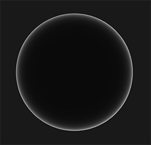

## Cook-Torrance BRDF

Cook-Torrance BRDF的镜面反射部分包含三个函数，此外分母部分还有一个标准化因子 。字母D，F与G分别代表着一种类型的函数，各个函数分别用来近似的计算出表面反射特性的一个特定部分。三个函数分别为法线分布函数(Normal **D**istribution Function)，菲涅尔方程(**F**resnel Rquation)和几何函数(**G**eometry Function)：

-   D项 - **法线分布函数**: 估算在受到表面粗糙度的影响下，朝向方向与半程向量一致的微平面的数量。这是用来估算微平面的主要函数。

    

```HLSL
half Function_D(half ndotH, half roughness)
{
    half a2 = roughness * roughness;
    half ndotH2 = ndotH * ndotH;
    half nom = a2;
    half denom = (ndotH2 * (a2 - 1.0) + 1.0);
    denom = PI * denom * denom;
    return nom/denom;
}
```


------


-   G项 - **几何函数**：

-   几何函数从统计学上近似的求得了微平面间相互遮蔽的比率，这种相互遮蔽会损耗光线的能量。

    

    

为了有效的估算几何部分，需要将观察方向（几何遮蔽(Geometry Obstruction)）和光线方向向量（几何阴影(Geometry Shadowing)）都考虑进去。我们可以使用史密斯法(Smith’s method)来把两者都纳入其中(第二次计算把v换成l)：


这里的k是α的重映射(Remapping)，取决于我们要用的是针对直接光照还是针对IBL光照的几何函数:


```HLSL
half GeometrySchlickGGX(half ndotV, half k)
{
    float nom   = ndotV;
    float denom = ndotV * (1.0 - k) + k;

    return nom / denom;
}

half GeometrySmith(half ndotV, half ndotL, half k)
{
    float ggx1 = GeometrySchlickGGX(ndotV, k);
    float ggx2 = GeometrySchlickGGX(ndotL, k);
    return ggx1 * ggx2;
}

half Function_G(half ndotV, half ndotL, half k)
{
    return GeometrySmith(ndotV, ndotL, k);
}
```


------


-   F项 - **菲涅尔方程**：菲涅尔方程描述的是在不同的表面角下表面所反射的光线所占的比率。

菲涅尔方程是一个相当复杂的方程式，不过幸运的是菲涅尔方程可以用Fresnel-Schlick近似法求得近似解：


F0表示平面的基础反射率，它是利用所谓**折射指数**(Indices of Refraction)或者说IOR计算得出的。然后正如你可以从球体表面看到的那样，我们越是朝球面掠角的方向上看（此时视线和表面法线的夹角接近90度）菲涅尔现象就越明显，反光就越强：



```HLSL
// calculate F0
half3 Calculate_F0(half3 albedo, half metalness)
{
    half3 F0 = 0.04;
    F0 = lerp(F0, albedo, metalness);
    return F0;
}

half3 Function_F(half ndotV, half3 albedo, half metalness)
{
    half3 F0 = Calculate_F0(albedo, metalness);
    return F0 + (1.0 - F0) * pow(1.0 - ndotV, 5.0);
}
```


------


这里的kd是早先提到过的入射光线中**被折射**部分的能量所占的比率，而ks是**被反射**部分的比率。BRDF的左侧表示的是漫反射部分，它被称为Lambertian漫反射，这和我们之前在漫反射着色中使用的常数因子类似，用如下的公式来表示：


------


BRDF的镜面反射部分要稍微更高级一些，它的形式如下所示：


```HLSL
// direct specular
half smoothness = 1;
half roughness = 1 - smoothness;
half functionD = Function_D(ndotH, roughness);
// remap roughness to k value
half kDirect = pow(roughness + 1, 2) / 8;
half direct_functionG = Function_G(ndotV, ndotL, kDirect);
half3 functionF = Function_F(ndotV, albedo, metalness);
half3 nominator = functionD * direct_functionG * functionF;
half demoninator = 4.0 * ndotV * ndotL + 0.001;
half3 specular = nominator / demoninator;
```


---


实时渲染中几乎只能使用Cook-Torrance BRDF模型。BRDF同时描绘入射光线和出射光线。严格上来说，Blinn-Phong光照模型也被认为是一个BRDF。然而由于Blinn-Phong模型并没有遵循能量守恒定律，因此它不被认为是基于物理的渲染。BRDF兼有漫反射和镜面反射两个部分：


最终渲染方程：


```HLSL
// Direct BRDF = Lambertian + Direct Specular
// direct specular
half smoothness = 1;
half roughness = 1 - smoothness;
half functionD = Function_D(ndotH, roughness);
// remap roughness to k value
half kDirect = pow(roughness + 1, 2) / 8;
half direct_functionG = Function_G(ndotV, ndotL, kDirect);
half3 functionF = Function_F(ndotV, albedo, metalness);
half3 nominator = functionD * direct_functionG * functionF;
half demoninator = 4.0 * ndotV * ndotL + 0.001;
half3 specular = nominator / demoninator;
// Lambertian
half3 kS = functionF; 
half3 kD = half3(1.0, 1.0, 1.0) - kS;
kD *= 1.0 - metalness;
// Render Equation
half3 radiance = mainLightColor * mainLightAtten;
half3 Lo = (kD * albedo / PI + kS * specular) * radiance * ndotL * AO;
half3 directColor = ambient + Lo;
```


---


## Image based lighting

IBL 通常使用（取自现实世界或从3D场景生成的）环境立方体贴图 (Cubemap) ，我们可以将立方体贴图的每个像素视为光源，在渲染方程中直接使用它。这种方式可以有效地捕捉环境的全局光照和氛围，使物体**更好地融入**其环境。

由于基于图像的光照算法会捕捉部分甚至全部的环境光照，通常认为它是一种更精确的环境光照输入格式，甚至也可以说是一种全局光照的粗略近似。基于此特性，IBL 对 PBR 很有意义，因为当我们将环境光纳入计算之后，物体在物理方面看起来会更加准确。

## 间接Diffuse

仔细观察漫反射积分，我们发现漫反射兰伯特项是一个常数项（颜色 c 、折射率 kd 和 π 在整个积分是常数），不依赖于任何积分变量。基于此，我们可以将常数项移出漫反射积分：


这边没有直接参考公式手写轮子，而是摘抄Unity在SphericalHarmonics.hlsl中的实现代码，原理相同，都是对环境光cubemap进行采样。

```HLSL
real3 SH_indirectDiffuse(real3 normalWS, real AO)
{
    real4 SHCoefficients[7];
    SHCoefficients[0] = unity_SHAr;
    SHCoefficients[1] = unity_SHAg;
    SHCoefficients[2] = unity_SHAb;
    SHCoefficients[3] = unity_SHBr;
    SHCoefficients[4] = unity_SHBg;
    SHCoefficients[5] = unity_SHBb;
    SHCoefficients[6] = unity_SHC;
    real3 color = SampleSH9(SHCoefficients, normalWS);
    return max(0, color) * AO;
}
```


------


## 间接Specular

间接高光部分的代码分别参考ImageBasedLighting.hlsl,  EntityLighing.hlsl, GlobalIllumination.hlsl的代码实现，用了比较偷懒的方式而不是完全手写。

```HLSL
half3 IndirectSpecular(half reflectVector, half roughness, half AO)
{
    half mip = PerceptualRoughnessToMipmapLevel(roughness);
    half4 encodedIrradiance = half4(SAMPLE_TEXTURECUBE_LOD(unity_SpecCube0, samplerunity_SpecCube0, reflectVector, mip));
    half3 irradiance = DecodeHDREnvironment(encodedIrradiance, unity_SpecCube0_HDR);
    return irradiance * AO;
}

// Indirect Function F
half3 EnvironmentBRDFSpecular(half roughness, half3 specular, half fresnelTerm, half grazingTerm)
{
    half surfaceReduction = 1.0 / (roughness * roughness + 1.0);
    return half3(surfaceReduction * lerp(specular, grazingTerm, fresnelTerm));
}
```


------


合并效果

最终结果 = 直接光漫反射 + 直接光镜面反射 + 间接光漫反射 + 间接光镜面反射

```HLSL
/ Indirect BRDF
// Indirect diffuse
half3 indirectDiffuse = SH_indirectDiffuse(normalWS, AO);
half3 indirectColor = indirectDiffuse * albedo;
// Indirect Specualr
half NoV = saturate(dot(normalWS, viewDirWS));
half fresnelTerm = Pow4(1.0 - NoV);
half oneMinusReflectivity = OneMinusReflectivityMetallic(metalness);
half reflectivity = half(1.0) - oneMinusReflectivity;
half grazingTerm = saturate(reflectivity + smoothness);
half3 indirectSpecular = IndirectSpecular(reflectVector, roughness, AO);
half3 brdfSpecular = Calculate_F0(albedo, metalness);
indirectColor += AO * indirectSpecular * EnvironmentBRDFSpecular(roughness, brdfSpecular, fresnelTerm, grazingTerm);
```

最后添加脸部和手部的emission fake SSS效果，最终合成效果如下


------


## 参考

1.   [URP管线的自学HLSL之路 第三十七篇 造一个PBR的轮子 - 哔哩哔哩 (bilibili.com)](https://www.bilibili.com/read/cv7510082)
2.   [Unity Shader - 搬砖日志 - URP PBR (抄作业篇，持续更新~)_Jave.Lin的博客-CSDN博客_unity urp的pbrshader](https://blog.csdn.net/linjf520/article/details/122464903)
3.   [理论 - LearnOpenGL CN (learnopengl-cn.github.io)](https://learnopengl-cn.github.io/07 PBR/01 Theory/)
4.   [URP管线PBR源码剖析（上） - 知乎 (zhihu.com)](https://zhuanlan.zhihu.com/p/371395846)

