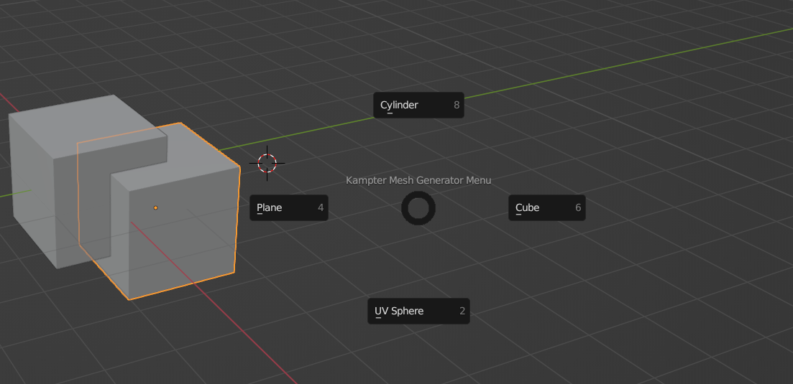

## Unity 仿只狼抓钩系统



[Github](https://github.com/Kampter/Unity_GrapplingHock_Test/tree/main)

## Blender 插件

### 自定义转盘

### 拼写检查

[实现原理](https://kampter.github.io/p/blender%E6%8F%92%E4%BB%B6%E5%BC%80%E5%8F%91%E5%85%A5%E9%97%A8/)