## 风格化毒液投射物



请原谅我制作了一个毒液的技能特效。我原本想要制作毒液效果的，但是尝试了多次后一直不满意，就把部分素材拼凑成了毒液的技能特效，希望可以得到谅解。这里我用UE5来制作这个技能特效。

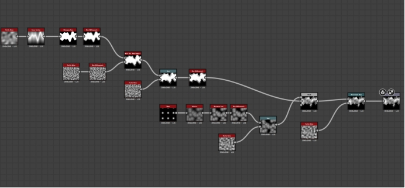 

Texture的思路：用cross section + histogram scan制造一条线，通过不断叠加noise制造细节，并且用blend的subtract模式减掉球状的shape，用来模拟液体的感觉。最后用Directional Warp制造速度的感觉。

 

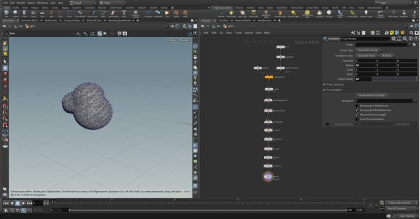 

 

原本Trail是不需要有mesh的，但是我希望力大出奇迹（bushi），只是希望最终呈现的效果更加立体吧。这里用 point jitter制造noise并且把球体copy to point 来制造这个不规则的球状物体作为 projectile 的mesh。 

 

Material的部分我分成三块，第一块是 Projectile，我希望用Fresnel来描述mesh的边缘发光的感觉。同时在这个Material里面我还添加erosion的效果在alpha mask中，希望在Niagara中可以驱动这个erosion 制造飞溅的小液滴的效果，而不是用particle来实现。除此之外我还用一张noise 贴图来驱动vertex posion，希望制造液体飞出主体但是与主体牵连的感觉(液滴表面张力)。 Smoke的部分，用一张Noise作为UV的distortion添加在Main Noise Texture上面，并且添加圆形的mask和depth fade减弱边缘。Trail部分与Smoke基本相同，在Mask部分我用了横向的Gradient Mask，希望Trail的尾部逐渐虚化掉。

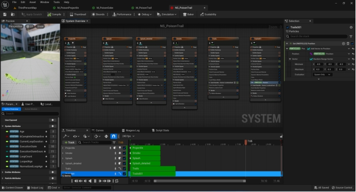 

 

Niagara实现：发射三个projectile mesh，用shape location + initial mesh orientation + rotate around point 实现绕圈旋转的效果，同时发射location event作为后续粒子的source，额外添加一个Light renderer实现ambient light的效果。两层的splash用projectile material的erosion动画实现，额外添加一些速度和force来制造细节。Trail的部分也是两层，一层较宽较浅色，整体细节比较少，一层颜色鲜明，变化的noise和细节增加。

 

 

## 抖动上升的会溶解的气泡



https://www.youtube.com/watch?v=bN84YxaBEGw 透明泡泡的材质有参考大佬的教学，主要是想要知道泡泡的 Iridescent shade究竟是怎么实现的, 毕竟在测试的这么短时间里手写扩展URP的Lit shader还是挺有挑战的。大佬的shader中用NdotV作为diffuse来采样gradient，这种手法与之前做过的卡通渲染有异曲同工之妙。

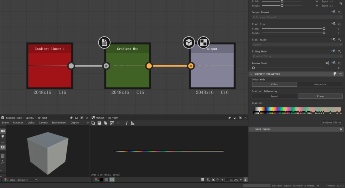 

颜色的部分我用比较讨巧的方式，在Substance designer中 sample 一个ground truth的gradient map，并且把颜色承载Fresnel里面控制边缘颜色

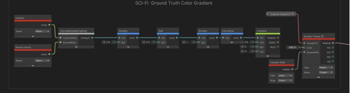 

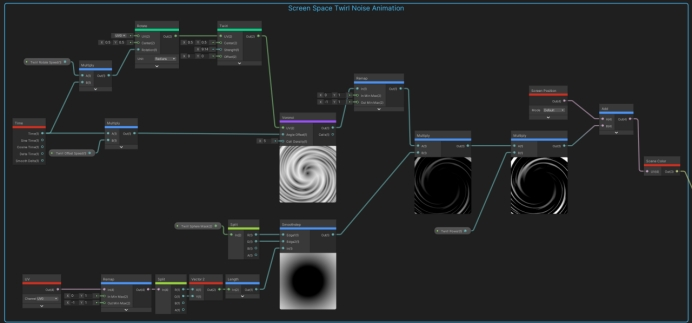气泡中还有那种波纹流动的液体感觉，Ben Cloward 的做法是直接采样一张类似的noise 贴图来模拟，我这里用了屏幕空间叠加的方式。用一个随时间变化的Twirl voronoi noise来模拟，并且叠加在Scene Color上面（需要在URP开启Opaque texture）

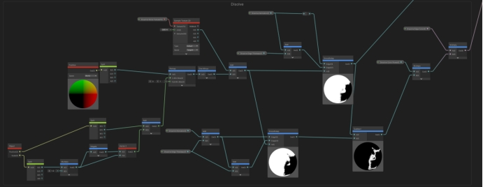 

消散的思路：一样通过输入noise，在noise上偏移一个很小的值并且输入smoothstep再相减来获取边缘的Mask。我额外计算一层Mask + edge后的结果输出到Alpha中，这样既可以有发光mask，又可以有alpha mask。

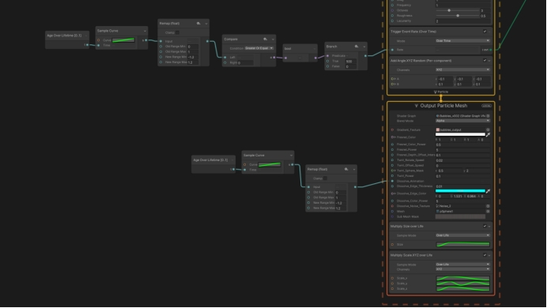 

 

在VFX graph制作比较简单，在一个区域内随即发射添加刚刚制作的shader的小球，让小球随着时间不断上升，并且让小球的scale_y随着时间不断变化，添加一些动态效果。

然后根据lifetime控制消散动画，并且在合适的时间上设置GPU event添加第二套粒子作为小球的消散后的效果。

这里有个小遗憾是没能实现第二套粒子精确发射在小球的消散边缘。查阅资料后发现了UE的实现办法：

[https://realtimevfx.com/t/spawning-particles-from-the-edge-of-dissolving/18715](https://realtimevfx.com/t/spawning-particles-from-the-edge-of-dissolving/18715，也就是额外在Niagara的module)

也就是额外在Niagara的module script中额外计算一套消散mask，在计算出的边缘mask位置做判断发射粒子。VFX graph可能可以但是我现在比较菜还没有实现。

另一个想到的比较通用的方式是在Houdini中提前Bakex消散动画的一张VAT，然后在小球需要消散的时间节点上播放这个动画，但是由于时间有限，以后我会尝试这个方案，参考如下。

https://docs.google.com/presentation/d/1n6ykDR_O_57FLuRqrO0Dlb9U0GYNZ-QLPX8DVg7asqE/edit#slide=id.p10

 

## 写实风格的雷击命中特效



闪电的部分会大致拆分成三部分来实现。第一部分是从天空中垂直落下的雷击，以蓝紫色为主体，伴有一些亮度较高的红黄色部分。第二部分是地面的命中痕迹，包括蓝紫色的感电效果，红黄色高亮的燃烧效果，以及黑灰色的烧焦痕迹。第三部分是地面由命中位置飞溅出来的碎块。

 

Main Strike部分：

 

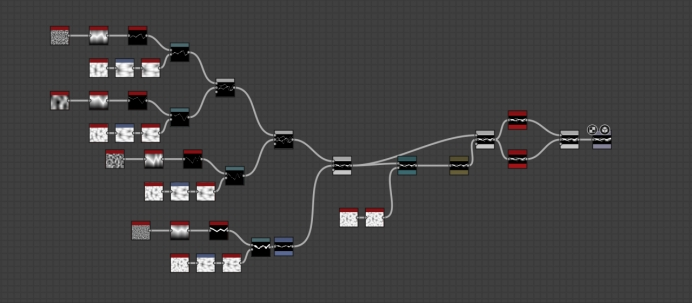 

贴图的部分，我使用用四层不同Scale的perlin noise增加细小线条的细节。做法是cross section后用historgram scan控制线条的宽度，并且每一层用cells1这个边缘很锐利的noise

来增加每一个线条的细小边缘。三层的细节加上一层的主体基本上就有我比较想要的效果（反复在引擎内测试）。另外再叠加1-2次的Blur来制造闪电线条周围发光的光晕感觉。

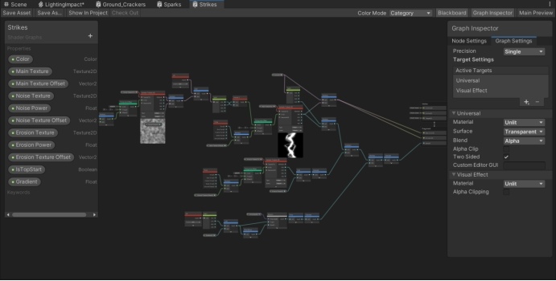 

Shader的部分我是用Shader graph来完成的。整体思路就是用Tilling and Offset来控制Strike 贴图随时间偏移，为了增加更多细节，在UV上面额外添加一层可以控制Tilling 和 Speed 的Noise 贴图。Erosion的部分直接把贴图当作alpha透明来使用，减去随时间变化的Noise贴图。最后额外添加一个IsTopStart来制造闪电的下落的动态下效果，思路也比较简单，用UV的V方向也就是垂直方向来添加一个偏移值，闪电两侧会被虚化掉。

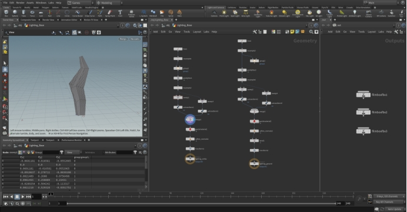 

 

Mesh制作我使用Houdini，尽管单面片的开销更低，我还是希望使用插片mesh，获得更好的立体感，思路也很简单。创建一条线，用point jitter来增加变化，用sweep来获得面片并且旋转90度生成插片，最后调整刚刚Sweep过的UV以及设置50 uniform scale，为了导入引擎更方便。

 

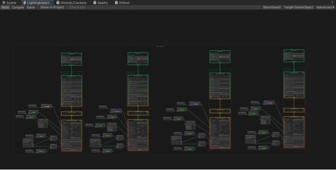 

在VFX graph中是这样使用的，一共四层闪电效果。每一层效果原理几乎相同，只对参数有细微调整。在Particle初始化中，我会设置好lifetime, 我会希望前两个主体的闪电是立即出现，而后会有2-3根细小的闪电再出现（希望有一点残影或者能量延迟的感觉）。同时闪电会有细微的位置和旋转角度变化。

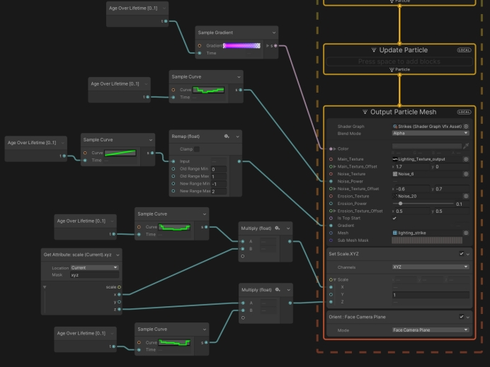 

 

主体的部分我会使用 Age over lifetime + sample curve 来设置刚刚shader中暴露好的参数。比如在主体色的部分，我会设置蓝紫色的主体以及少量的红黄色高能量的闪电。我还会设置闪电的大小，希望闪电的在X和Z方向的scale变化是比较硬的变化，来制造一种迅猛变化的感觉。

Spark的部分：

贴图我比较偷懒继续使用刚刚Stike的贴图，VFX graph中的设置也比较简单，设置好随时间变化的大小，旋转等参数即可。

 

Ground Crack 的部分：

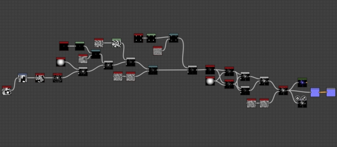 

 

贴图的思路，用Cells4 + shape mapper制造地裂的原型基础感觉, 用shape 和perlin noise接入 warp来制造细节叠加进来。对于需要删除的部分用Blend 的subtract 模式不断尝试剔除不需要的地方。当效果基本到自己想要的感觉后，再用不同的blur增加地面裂开的宽度，并且模拟地面被劈开后缝隙中的感电和火光带来的辉光效果。

 

Shader的部分与Stike的思路其实差不多。区别在于Erosion的边缘我希望有一些渐变而不是很硬的过度，因此用smoothstep来代替subtract。这里我几乎对每一个参数，比如color, alpha, emission 都有分别添加erosion，希望分别控制地面的效果，同时希望感电的区域出现在地裂的里面。对于地面裂开的地方，我使用了POM视察映射，希望增加更多细节。

 

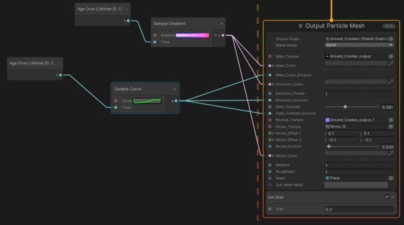 

VFX graph中，我是用三层不同的Crack效果，第一层是蓝紫色的感电效果，第二层是红黄色的高能量燃烧效果，最后是几乎纯黑色的焦痕，并且焦痕会持续更久一些直到完全消散掉。